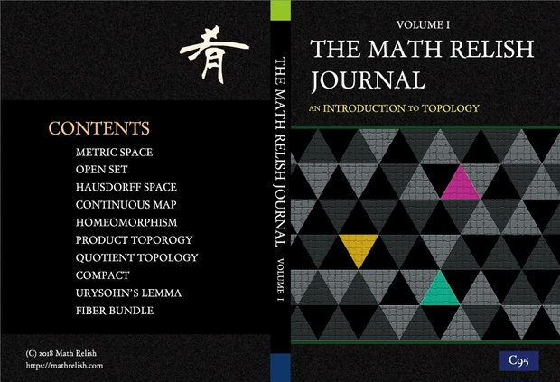
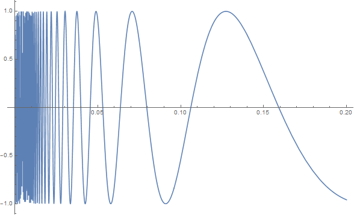

# 位相空間論 - オススメの参考書

位相空間論は抽象的で学ぶのはとても難しいといえるだろう． 図形のトポロジーという言葉はそれをある程度は易しいものにしてくれる． 何故なら位相空間論を幾何学的にみて， ゴムの幾何学とでもいうべき位相幾何学で具象的に話せるからである．

しかし位相空間論それ自体は集合論の基礎にも近く，なかなかとっつきづらいところがある． 証明のパターンのようなものを体で覚えて， 論証によって突き進んでいくところが少なくないからである．

以下では位相空間論に関連したより高度な専門に進むのに 必要なきっかけや基礎力を与えてくれる書籍を紹介する．

## ざっくりわかるトポロジー 内側も外側もない「クラインの壺」ってどんな壺? (サイエンス・アイ新書)

[](https://www.amazon.co.jp/%E3%81%96%E3%81%A3%E3%81%8F%E3%82%8A%E3%82%8F%E3%81%8B%E3%82%8B%E3%83%88%E3%83%9D%E3%83%AD%E3%82%B8%E3%83%BC-%E5%86%85%E5%81%B4%E3%82%82%E5%A4%96%E5%81%B4%E3%82%82%E3%81%AA%E3%81%84%E3%80%8C%E3%82%AF%E3%83%A9%E3%82%A4%E3%83%B3%E3%81%AE%E5%A3%BA%E3%80%8D%E3%81%A3%E3%81%A6%E3%81%A9%E3%82%93%E3%81%AA%E5%A3%BA-%E3%82%B5%E3%82%A4%E3%82%A8%E3%83%B3%E3%82%B9%E3%83%BB%E3%82%A2%E3%82%A4%E6%96%B0%E6%9B%B8-%E4%BB%8A%E9%87%8E-%E7%B4%80%E9%9B%84/dp/4797364440/ref=as_li_ss_il?ie=UTF8&qid=1535186976&sr=8-1-fkmr1&keywords=%E3%81%93%E3%82%8C%E3%81%AA%E3%82%89%E3%82%8F%E3%81%8B%E3%82%8B%E3%80%80%E3%83%88%E3%83%9D%E3%83%AD%E3%82%B8%E3%83%BC&linkCode=li3&tag=alexandritefi-22&linkId=c9e50dbed7f21676df0447de218a0f0e&language=ja_JP)

本書は位相をちょっとだけ知りたい方はもちろんのこと，ある程度，学習をした方にもオススメする書籍である． 普通はどちらか一方しか対象にならないところがあるが，この書籍では専門的な用語も頑張って説明しており好感が持てるからである．難しいことをテキトーにわかったように説明すること，もしくは簡単すぎる話を薄く伸ばして重複も恐れず説明することに溢れた現代では珍しい良書だと思う． 値段も安いので気軽に購入して気軽に読める本である．オススメだ．

[ざっくりわかるトポロジー 内側も外側もない「クラインの壺」ってどんな壺? (サイエンス・アイ新書)](https://amzn.to/2PCeC7J)

## The Math Relish Journal Volume 1

Math Relish (https://mathrelish.com) に掲載している位相空間論を順序だってまとめた書籍． 位相空間論の専門書ほど充実はしていないが， かといって絵だけの本や啓蒙書レベルの論述でもなく， これだけは知っておきたい考え方や事柄を証明付きでまとめた書籍． すべての主張に証明は付いていないが，証明を付けた事柄は押さえておきたいものになっており， 専門外や初学者の方に向けた内容になっている．

> 多様体に取り組む前に最低限必要な知識は得られるのではないかなと思います． 当サークルで多様体勉強会の前に行った２～３日分くらいの内容ですが， エッセンスは込められたのではと思います(たいです)．

[位相空間論への入門 | The Math Relish Journal Volume 1: An Introduction to Topology (BOOTH)](https://mathrelish.booth.pm/items/1123647) [MRJ1 ができるまで @C95](https://mathrelish.com/original-goods/the-math-relish-journal-volume-1)

## 位相への30講 (数学30講シリーズ)

数学30講シリーズの一つ．このシリーズはとにかく親しみやすい． 順を追って一つずつ着実に読み進めることができる． しかもイメージしやすい話題や，様々な図を丁寧に用意してくれている． 式変形もやはり丁寧で，仮に好きな章だけ読むにしても前の章の計算を逐一追うことも少ない． 何はともあれ「位相」という言葉にはじめて触れるなら，この一冊がオススメである．

[位相への30講 (数学30講シリーズ)](https://amzn.to/2P2nhPG)

## はじめての集合と位相

まとまった時間を確保して，ガッと集中的に集合と位相の基本を身につけるなら，この書籍が最適に思う． 位相空間論は集合論を土台にしているので，最低限のことを知らないと位相空間を学ぶのは辛い． 数学はとかく積み重ねが必要な学問の一つだ．しばしば未解決問題が解けた後に「過去の人々が解けなくて当然だ」と言われることがあるが，まさにそういったことが普段の学習にも起こり得る．

位相空間論を理解できる程度に集合論の基本がまとめられているのもポイントが高い． 集合論はついついしっかりやろうとしてしまうほど，面白いトピックがたくさんある． 公理系や強制法など，戻ってこれないところがあるので，ひとまずはこの書籍で数学的な議論の入り口に立つとよいだろう．

[はじめての集合と位相](https://amzn.to/2Nhoi66) ([書籍公式ページ](http://www12.plala.or.jp/echohta/top/tpage04a.html))

## はじめよう位相空間

集合論のことがまぁある程度はわかっていて，位相空間論だけ焦点を当てて，短時間で集中的に身につけたい場合にはこの書籍が最適であろう．どうしても一般向けや入門者向けには「逆像がどうのこうの」といった地味ではあるが，しっかりと理解するには必須な議論が省かれがちである． 本書はそういった数学の正道を歩くための「あれやこれや」が配慮された，真に基本を学びたい方向けの書籍と思う．はじめての方はひょっとしたら面食らうかもしれないが，位相をしっかりと理解するにはこういった事柄が必要なんだ，と一つずつ確実に読めば，相当な力がつく書籍だと思う．

[はじめよう位相空間](https://amzn.to/2NcI96m) ([書籍公式ページ](http://www12.plala.or.jp/echohta/top/tpage01a.html))

## 解いてみよう位相空間〔改訂版〕

『[はじめよう位相空間](https://amzn.to/2NcI96m)』の姉妹本ともいうべき書籍で，こちらは演習を主に担う．問題の解答も完璧についており，安心して取り組むことができる． 位相空間論は抽象的であるので，頼りになるのは論証のパターンともいうべきものである． これはもう，九九を覚えるような，ある程度の時間は絶対に必要な事柄で，とにかく解きまくればよい．

大学数学以上になると，理論と演習の二冊がいつでもついていることは大変珍しい． 普通は理論の本におまけ程度に演習が載っているくらいで，演習の本は絶版になりがちな理工書のジャンルの中では貴重なジャンルである． 専門課程で何らか演習の時間が設けられていると思うが，とても足らないだろう． ましてや非専門となると，せいぜい理論を修めるだけで終わる．

著者の書く本は教育的配慮が様々になされており，そういった面でも貴重な本である． 「賢い人＝教えるのがうまい人」というわけではないからである． 多くの場合で等号は成立しない．日本語自体が怪しい人も結構いる． 本書は「改訂版」とあるように，それだけ支持されていて，加えて著者が改定を頑張る意思があったという点が評価に値する．普通，そういった意思をもつほど大学の教員はゆとりがない．身を削ってでも書いてくれたことに感謝の言葉しかない．

[解いてみよう位相空間〔改訂版〕](https://amzn.to/2P6g2Xg) ([書籍公式ページ](http://www12.plala.or.jp/echohta/top/tpage05a.html))

## 集合・位相入門

|    |  |
| --- | --- |

定番中の定番．

素朴な集合論の面白い話もありつつ，位相空間論の様々な定義がユークリッド空間からどのように抽象化されていったかを逐一説明してくれている．このレベルで懇切丁寧に説明してくれている数学の専門書の極大値なように思う．もっともっと高度で専門的な話を仮に平易に説明しようとすると，どうしてもできないことになってくる．そういった書籍を書く著者の力量とかではなく，洗練されすぎていて説明が長くならざるを得ないし，仮にそれを実行したとしても果たしてどれだけの人が読んでくれるだろうか．そういったトレードオフを考えると，集合と位相というのはおよそ数学をする者なら誰しもが通るところでありながら，これまでの計算主体の数学観とはかけ離れた世界への入り口という点で，やはり極大になるのではと思っている．

[集合・位相入門 (松坂和夫　数学入門シリーズ)](https://amzn.to/3oiBrhA) [集合・位相入門](https://amzn.to/2P2wCXO)

## 現代数学への招待:多様体とは何か (ちくま学芸文庫)

多様体は位相空間の構造に更に微分構造を入れたより一般的な空間であるわけだが， 従ってその多様体へと至るのに必然的に位相空間論が基礎になる． 本書は「多様体とは何か」という副題にある通り，多様体はどうしてそのような定義なのか，定義に至る下部の構造はどのようなものかといった事柄を述べている． そのため多様体へと通ずる視点で位相空間論を一数学者はどのようにみているかを本書で知ることができる． 専門書は淡々と定義，定理，証明といったペースで主観が一切表れないといってもよいもので，こういった書籍はたいへん貴重である．

[現代数学への招待:多様体とは何か (ちくま学芸文庫)](https://amzn.to/2waZxSA)

## 「集合と位相」をなぜ学ぶのか ― 数学の基礎として根づくまでの歴史

数学の歴史を述べる数学史というのは，調べるのはけっこう大変である．位相のような概念をある日突然に思い浮かぶには相当な歴史的な下地が必要である．そういった歴史的な下地は，はじめて位相を学ぶ者にとっても有益な情報であることが多い．

けれどもやっぱり数学史を扱った本は少ない．微積分学や線型代数学の本は毎年新刊が出ていてもおかしくないような，もう正直，飽和状態な気がしてならないが，一方で数学史の本は大きな書店に行かないと決して会えないくらいに希少な本であろう．

何か明確な意図があって，位相空間論という一大分野ができているわけである．それは何か広く物事を基礎づけるものであったりするはずだ．歴史を紐解いていくと，自ずと自然な流れでそれがわかってくる．数学のいろいろな研究が一体何に問題意識を持っているのか，そういったこともわかってくる．位相にスポットライトを当てた数学史は大変珍しいと思う．オススメしたい一冊である．

[「集合と位相」をなぜ学ぶのか ― 数学の基礎として根づくまでの歴史](https://amzn.to/2MWkbj7)

## 位相のこころ (ちくま学芸文庫)

本書は位相空間論に一度どっぷりと浸かった後に読むことをオススメする書籍である． というのも (何でもそうだとは思うが) ちょっとやそっとでは「こころ」というものは理解できないからである．

本書は位相空間論の用語ごとにセクションが区切られているので，ある種，モノグラフのように使用できる．それが故に，まず位相空間論に表れる用語に自分なりの世界観がないと読むのが辛いと思う．逆に言えば，この書籍を読んで「わかりやすい」と思ったら，位相空間論について平均以上は理解していると言えるだろう．

著者は生涯で次の二本しか論文を書いていない(と思う)．

- [Topological structures in ordered linear spaces.](https://projecteuclid.org/download/pdf_1/euclid.jmsj/1261154155)
- [On the Group Structure o f Boolean Lattices](https://www.jstage.jst.go.jp/article/pjab1945/32/7/32_7_423/_pdf)

それらは大論文というわけでもない．余裕のある古き良き時代だ． その二本は位相空間論と関連のある論文で，彼だからこそ位相について人一倍悩んで親しんだのかもしれない．そんなことを少し思いながら読んでみるのも良いかもしれない．

[位相のこころ (ちくま学芸文庫)](https://amzn.to/2P6JaO5)

## Counterexamples in Topology (Dover Books on Mathematics)

数学ではよくあることだが，病的な例というのが位相空間論にもある．

[病的な (数学)](https://ja.wikipedia.org/wiki/%E7%97%85%E7%9A%84%E3%81%AA_\(%E6%95%B0%E5%AD%A6\))

そういったものを集めたのが本書である．表紙は「位相幾何学者の正弦曲線」である． これは連結であるが局所連結でも弧状連結でもない例として有名である．

[位相幾何学者の正弦曲線](https://ja.wikipedia.org/wiki/%E4%BD%8D%E7%9B%B8%E5%B9%BE%E4%BD%95%E5%AD%A6%E8%80%85%E3%81%AE%E6%AD%A3%E5%BC%A6%E6%9B%B2%E7%B7%9A)

わざわざ何故そのような定義をする必要があるのか，といったことを考えるとき，病的な例がしばしば反例として役に立つ．それがまとまっているので，とても心強い書籍である． 「へぇーこんなのもあるんだぁ」ときっと思う．

書籍には全部で 143 個の反例が載っており，巻末の附録には各反例が以下のトピックについてどのような性質を満たすかの荘厳な真理値表が載っている．

- 分離公理
- コンパクト性
- パラコンパクト性
- 連結性
- 非連結性
- 距離化

[Counterexamples in Topology (Dover Books on Mathematics)](https://amzn.to/2BLy7rB)

### π-Base

数学では理解を深めるのに反例を考えて，定義の理解を鋭くすることがよくある． 位相空間論は抽象度が高く，直感が通用しなくなるのが割と早い部類である． そこで反例をしばしば考えるのだが，既に先人たちがあれこれ考えており， 有名なものがゴロゴロある． 『[Counterexamples in Topology (Dover Books on Mathematics)](https://amzn.to/2BLy7rB)』はその成果物の一つだが， 下記のサイトでも同様に反例を検索することができてオススメである．

[π-Base](https://topology.jdabbs.com/)

* * *

最後に宣伝で恐縮でありますが， Math Relish 物販部もご利用いただけたらと思います．

[Math Relish 物販部](https://mathrelish.booth.pm/)
