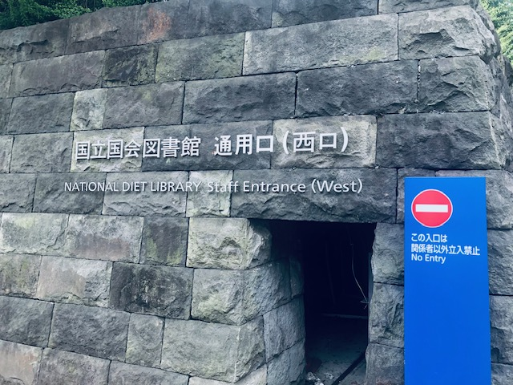
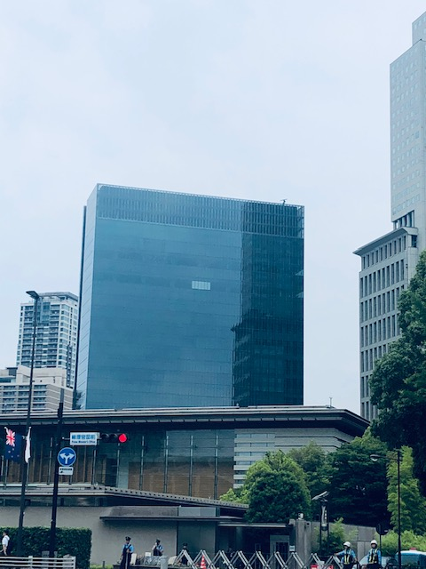
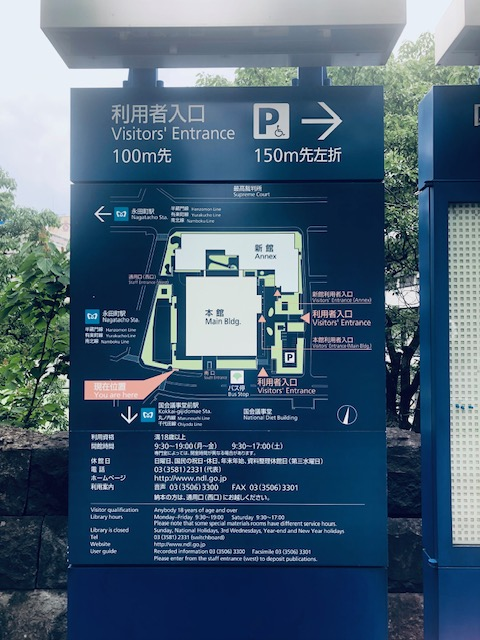
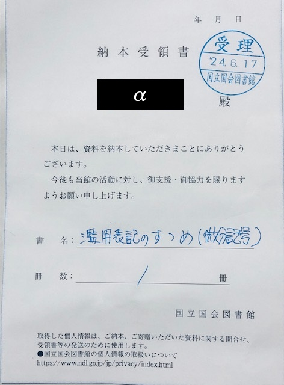
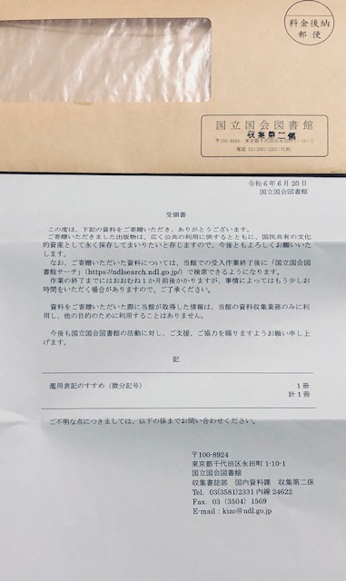

# 国立国会図書館への納本レポート

『[濫用表記のすゝめ (微分記号)](https://mathrelish.booth.pm/items/5738559)』を納本してきました！

[The Math Relish Journal Volume 6 (BOOTH)](https://mathrelish.booth.pm/items/5738559)

## 事前準備

お問い合わせするとだいたい次のようなご返答をいただきました．

- 紙の部数としては 100 冊以上が目安
- 電子版などのオンデマンドだと 15 冊以上が目安
- 納本する本と一緒に正誤表のような補足資料もあれば一応見るとのこと

ということで電子版について前提条件を満たしていましたから， 『[濫用表記のすゝめ (微分記号)](https://mathrelish.booth.pm/items/5738559)』の納本に現地へ向かいました！

## 納本までの順路

国立国会図書館は永田町駅が最寄り駅になっています． 目と鼻の先で非常に近いです．なんですけども・・・

今回は観光もかねて国会議事堂前駅から，少し歩く形で国立国会図書館を目指しました． こんなことでもない限りは，なかなか来ませんからね． 交差点や各種の重要建築物に警察官が配置についていて，国家の中枢感がありました． いやぁ，建物がしっかりしている．完全にお上りさんの状態でした．

国立国会図書館に着くと，納本ということで，西側の通用口を目指します．

行くとわかるのですが，西口は搬入用という感じ． ちょうどクロネコヤマトのトラックが止めてありました． 本を運んでいたのでしょうか．

そのまま下って右手に曲がると，横断歩道があります． これを進めば館内入り口に着きます．

館内入り口で，警備員の方に「納本に来ました」と伝えて，簡単な手続きをしました． 緑色のバッジをもらったら，胸につけて，納本窓口に向かいます．

## いざ，納本！

納本のための部屋に行くわけですが，人影がありません． 本当にちょっとした机が一つあって，そこにブザーが置いてありました． 仕方ないので，ブザーを鳴らしてしばらくすると，係の方がいらしてくださいました．

寄贈ということで，本と正誤表＆補足ノートをセットで納めました． このとき簡単な受領証を書きました．

非常に簡単なやりとりのみで，特に何かあれこれ質問されることなく， 手続きが終了しました． 噂には聞いていましたが，実にあっさりとしておりました．

というわけで，これにて納本が完了しました． おそらく書誌データが作成されることでしょう．

いっそ，bibtext も一緒に渡すべきだったかどうか，帰路で急に気になりだしました． まぁ実際にできた書誌データを見て，必要であればあれこれ考えたいと思います．

## キュート数学１の初版

ついでなので，国立国会図書館の登録利用者カードを作ることにしました． 正確には期限切れだったカードを回収してもらって，新規に作り直すことにしました． (カードの所有権はあくまで国立国会図書館側が有しているので，期限切れでも勝手に破棄しないようにしましょう)

というわけで今度は一般利用者ですから，東に回って新館へ向かいました． で，その日のうちに無料で作ってもらって，館内に入ることができました． 今回はあまり時間もなかったので，『[キュート数学１](https://ndlsearch.ndl.go.jp/books/R100000002-I000007409012)』を閲覧することにしました．

『[濫用表記のすゝめ (微分記号)](https://mathrelish.booth.pm/items/5738559)』でもとりあげた[こちら](https://mmfftt.blogspot.com/2018/10/blog-post.html)で言及されている函数の音訳説について，キュート数学１という本を挙げています．キュート数学１は何度か[復刊](https://amzn.to/3KQdV8E)しているのですが，果たして原典である初版も同じ記述なのか気になっていたのです．まだデジタル化されていないので，簡単にはチェックできず，せっかくなので，現物確認しようと思ったわけです．

- [基礎からわかる数学入門 数の発展から微分積分まで](https://amzn.to/3KQdV8E)

国立国会図書館は閉架式なので，閲覧したい本は館内で持ってきてもらうようオーダーを出すことになっています． で，待つこと，３０分．図書カウンターに届きました．

さてさて，中身を確認！ おお，同じ記述．

> (中略) 同時に音も似ているらしい (中略)

これ，これですよ．この不確かな記述．

『キュート数学１』の前書きは 1967 年 3 月とあります． なので，おそらく原稿を書いていたのは 1966 年． 遠山啓氏が 57 ～ 58 歳の頃です．

というわけで，やはり音訳説は 1967 年頃まで遡れると判明しました．

## 書誌登録！！

後日，受領書が届いてそこには登録までに一か月前後とありましたが， なんと約６日？で無事に書誌登録されました！

[The math relish journal. Volume 6 改訂増補第2版](https://ndlsearch.ndl.go.jp/books/R100000002-I033536636)

ご担当者様，ありがとうございます．
