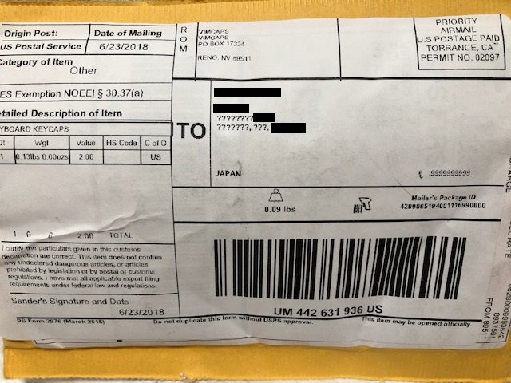

# Vimmer 御用達 (?) なキーキャップ

その名も SA Carbon Vimcaps!

## Vim ってなにさ？

おそらくこのページにたどり着いた方には，蛇足というものですが， Vim というのはたいへん古くからあるテキストエディタのことです．

今でこそ VSCode や SublimeText に Atom など，モダンなテキストエディタがあり， 現代の人々にとってはとっつきにくさ全開のエディタであろう代物で， 特にこだわりがなければ Vim を選ぶ方はプログラマでもあまりいないのかもしれません．

16 bit アプリの時代，今とは比べ物にならない非力なマシンでプログラムを書くには，軽いエディタが今以上に求められました．Emacs を開こうものなら，とにかく待たねばなりませんでした．一旦開いてしまうと，それはそれでもうよいのですが，なんやかんやと起動というのは軽くしたいものです．

サクッと起動して，サクッと編集して，サクッと保存して，サクッと終了したいわけです．

そこで vi がくるというわけです．

ただまぁ慣れたとしても当時の Vi\[m\] は非力といいますか，日本語とか漢字変換とか大変だったのではないかと，記憶をたどるとあまり良い記憶がありません[1](#fn-727-Canna)．

結局，Emacs, Vim 懐かしくは VZ[2](#fn-727-VZ)/MIFES[3](#fn-727-MIFES) と三者三様の世界で使い分けていたように思います． どれも素晴らしい作品です．

## Vimcaps

さて本題の Vimcaps ですが，これはキートップに Vim の象徴的な移動キーである HJKL について， ←↓↑→ が印字されたキーキャップです．

下記のページにもありますとおり，元はビル・ジョイのいたカリフォルニア大学バークレー校に ADM-3A 端末が導入され，彼自らのソフトウェア開発の効率を上げるために vi が開発されました．

その ADM-3A 端末にはカーソルキーがなく，HJKL に ←↓↑→ と印字されていたのが， 起源となって vi の代名詞ともいえるキーバインドができあがったというわけです．

Vimcaps はその当時の趣を復元した実に味のある一品です． Vimcaps を手にすることでかつての開発環境が蘇るのです．

## 注文から届くまで

### 注文

Vimcaps は下記のページで売っています．

[Vimcaps](https://vimcaps.com/)

ホームページに書いてあるように Vimcaps は下記のオーダーメイドの副産物とわかります．

[Signature Plastics](http://www.solutionsinplastic.com/)

肝心の注文ページですが，Google 検索で見つけるしかないようです． 間違ってたらすみません． 今回の注文を行ったページは下記のページです．

[SA Carbon Vimcaps Sale](https://vimcaps.com/carbon.html)

### 待てば海路の日和あり

2017/10/1 に支払いを済ませて，ページ上の予告どおり 2018/3 の春を待ちました．

すると 3/26 に一通のメールが．

> Hello! Now is the last chance to make changes to your address before I ship these (sometime in the next few days). Also, If you have buyer's remorse, it is not too late to request a refund. If you need to make changes, please send an email to shipping@vimcaps.com. If everything is still the same you have two options: Do nothing, and I'll use the address on file Send a confirmation email to shipping@vimcaps.com If you have any other sort of question, send an email to questions@vimcaps.com Thank you very much for your patience and support. I can wait to get these keys out to you. -Brandon vimcaps.com

送付先住所の最終確認です． 特に変わってないので，ここはスルーで，後もう少しの我慢だとわかりました． 予告通りです！

ところが．

> International Shipment Delays I am very sorry for the delay in shipping your order. The US Postal Service changed its international shipping procedures, and I have no idea if my previous method works. I sent out a test order April 3rd, but I still haven't heard anything about its success or failure. I have to be pretty cautious too, because I don't have enough extras to cover lost shipments. I'm sorry for taking so long to send an update, but I will be quick with a second update when I know the results of my test (or when I give up and just conduct a second one). If you are unwilling to accept any more delays, send me an email, and I will promptly refund your money. -Brandon vimcaps.com

というメールが 4/17 に来ました．

雲行きが怪しくなりました． キャンセルで即返金するとありましたが，待つことに決めました．

それからは一または二週間おきの定期的に同じ内容のメールが送られてきました． (こういうところがとても信頼できる印象を抱かせます)

そしてつい先日，6/19 に "Your order has been shipped!" なるタイトルのメールが送られてきました． ようやく，ようやく船便が通ったのです！！

### 届く！

「届いた．本当に届いたぞ！！」

いやぁ，とても嬉しかったです．待った甲斐がありました． 黒塗りのところが住所なのですが，一部 ????? と文字化けしていました． よく届いたものです．

「うおおお，ちゃんと入ってる！！！」

(開封の儀が始まりました)

予備に 2 セット購入したのですが，確かに入っていました！

並べてみます．

この色合いがなんとも素晴らしい．

## 次回作

次の Vimcaps のテーマは Oblivion (忘却) です．

[Oblivion Vimcaps](https://vimcaps.com/oblivion.html)

オリジナルの ADM-3A 端末にあったキーの色合いとよく似ているような気がします． これは期待大！！

## Vim 書籍

|  |  |  |  |
| --- | --- | --- | --- |

* * *

2. Canna を思い出しました．ありましたね．えっ，知らない？！ [↩](#fnref-727-Canna)

4. VZ Editor は WZ Editor として現在もシェアウェアとして受け継がれています．公式サイトは [ココ](http://www.wzsoft.jp/) です． [↩](#fnref-727-VZ)

6. MIFES は現在もシェアウェアとして生き残っています．[MIFES 10](https://amzn.to/2MHq5Rc) が 2018/7/7 時点での最新版です． [↩](#fnref-727-MIFES)
