# 複素解析での特異点とは - ヴィジュアルな色相環を用いたプロットを通して

複素解析での微分可能性は実解析の場合と比べて遥かに強力で，一度，微分可能性が示されたならば，その複素関数は何回でも微分可能であることが保証された．そしてこのような複素関数を正則関数といった．

このような有様なので，微分可能でない点，即ち正則でない点は実解析の場合と比べて，何回目の微分についてのものかを一々気にする必要がなくなり，複素解析では強い個性を放つことになる．

## 背景と着想

### 特異点

複素解析での特異点とは，正則でない点のことだが，実解析では邪魔モノでしかなかった存在が驚くほどに変貌して主役に躍り出る．無限遠点というある種の非有界な対象まで含めた取り扱いも，実解析と比べて遥かに強固なものにし，代数規則すら導入する契機を与える．

さてどのような場合に微分不可能になろうか．それは一口に言ってしまえば，微分での極限操作が定まらない場合であり，主に次の二つがある．

- 収束しない．
- 一意に存在しない．

このような特異点のうち，極とよぶ種類の特異点が非常に重要になるのである．

### 複素関数のプロット

少し道をそれるかもしれないが，極の重要性と積分路の変形自由度を知ると，最早それらだけしか気にしなくなる． 複素平面上に極と積分路を描いて，終わり，という調子である． 正則な点で複素関数がどのような複素数値をとるかといったことは気にしなくなる． 確かに複素解析のうち複素積分だけ，しかも計算だけならそうならざるを得ない．

関数の個性のようなものがどうでもよくなるわけである． これは仕方がないという一面がある． 何故なら実解析にはなかった困難があるからだ．それは関数のプロットである．

つまり複素関数は $\mathbb{C}\rightarrow\mathbb{C}$ なる対応であるため，実解析の延長でこれを単純に捉えると $\mathbb{R}^4$ が必要になってしまい，お手上げになってしまうからだ． ということで複素関数のプロットはえてして省略される．

けれども伝統的に複素関数特有の上手いプロットがあり，これによって極や零点の情報についても視覚的に理解ができるのである．

そこで以下では最初に複素関数のプロットについて述べた後，特異点の言及をすることにする．

## 定義

### 複素関数の色相環プロット

複素関数 $f(x)$ のプロット方法は主に次の二つがある．

- 極形式に依拠したプロット
- 等角写像に依拠したプロット

このうち前者を以下で扱う．その定義は次のとおり．

複素関数 $f(x)$ が与えられたとき，その大きさを明度もしくは高さで表し，偏角を色相環で表すプロットを極形式に依拠した複素関数の色相環プロットとよぶことにする．

ここに色相環 (color wheel) とは次のような図のことをいう．

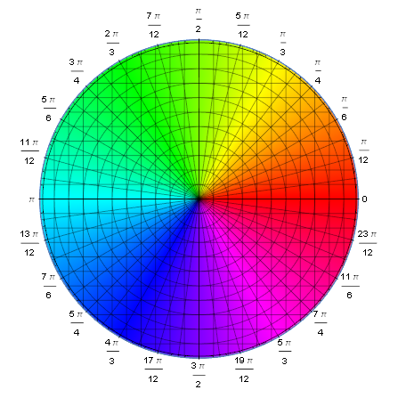

赤から始まって黄・緑・青・紫と巡って赤へと戻る． この変化を偏角が $0$ から $2\pi$ への変化と対応させるのである．

また明度による大きさの表現方法は，$0$ から正の無限大への変換を「暗い」から「明るい」という変化に対応させて表現する．この他，(多くの場合，対数スケールで) 等高線を描いて，大きさの変化の程度を表現する．

この話題に関しては [Visual Complex Functions: An Introduction with Phase Portraits](https://amzn.to/3avRz91) という本がとてもオススメ． この本でも言及されているが， 「極形式に依拠したプロット」は domain coloring とか color wheel graph とよばれ， Wikipedia に拠れば， [Lawrence(Larry) Crone](https://www.american.edu/cas/faculty/lcrone.cfm) が 1980 年代後半に最初に考案したようだ． [Hans Lundmark](https://users.mai.liu.se/hanlu09/complex/) もまた同様のことを述べている．

[Domain coloring](https://en.wikipedia.org/wiki/Domain_coloring)

### 冪とプロットの対応

極形式に依拠したプロットの利点は支配的な冪を可視化できる点である．

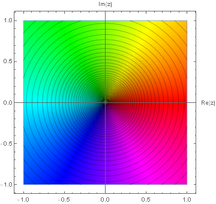

上は $f(z):=z$ のプロットである．偏角は色相環と同じようにたどるので象限周りの変化となる．

そして下は $f(z;n) := z^n$ のプロットで，左から $n=-2,-1,0,1,2$ である．

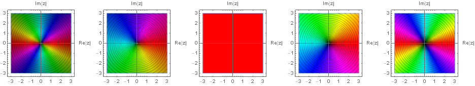

冪だけ偏角の進み具合に影響を与えるため，正冪 $n$ であれば象限周りに $n$ 回だけ色相環を周回する．逆に負冪 $n$ であれば逆象限周りに $n$ 周する．そして特に定数であればすべて同じ色に染まる．

更に次の図は複素関数の支配的な冪の可視化として見れる．

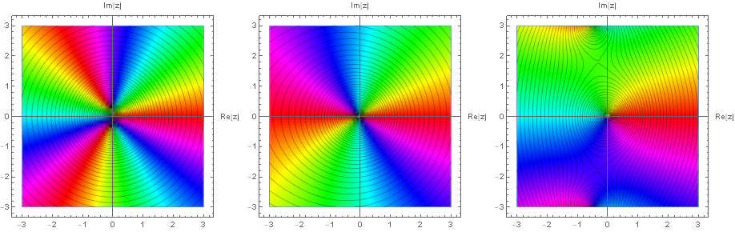

これらは左から順に以下の関数のプロットである．

\begin{eqnarray} 10z^3+z^2+z \\ z^3+10z^2+z \\ z^3+z^2+10z \end{eqnarray}

支配的な冪が $3,2,1$ であるが，その様子がプロットから読み取れるだろう． また次は $z^3+z^2+z+10$ という複素関数のプロットである．

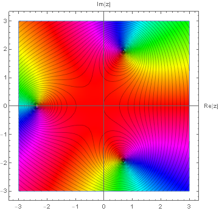

赤い箇所が偏角 $0$ の領域であり，それが広くなっているので定数項が支配的であることをプロットから読み取れる．また位数まで含めた零点の位置も明らかだ．

以上から複素関数がより real な存在に見えてくることだろう．

### 特異点

複素解析では正則でない点を特異点という．

上記の簡明な定義から更に幾つかの種類に分かれる．

#### 孤立特異点と集積特異点

まず第一の分類は位相的な違いに拠るもので，孤立特異点と集積特異点という分類である．

複素解析での特異点が，孤立特異点であるとか，もしくは集積特異点であるとは次のことをいう．

特異点 $z=p$ を中心としてある半径 $\rho$ の円を描くとき，その内部と中心である特異点 $z=p$ を除いた領域で他の別の特異点が含まれないとき，特異点 $z=p$ を孤立特異点という．そして孤立特異点でない特異点を集積特異点という．

即ち，集積特異点は特異点 $z=p$ を中心としてどんなに小さい円を描いても，その内部に他の別の特異点 $z=p^{\prime}$ が含まれる特異点である．

孤立特異点は更に三種の特異点に細分類される．

- 可除特異点
- 極
- 孤立真正特異点

それぞれの定義は以下のとおりである．

点 $z=p$ では定義できない複素関数 $f(z)$ であるが，$\lim_{z\rightarrow p}f(z)$ が確定値をもつとき，点 $z=p$ を複素関数 $f(z)$ の可除特異点といい，$f(z)$ を点 $z=p$ で正則にした関数 $g(z)$ へと再定義できる．

\begin{equation} g(z) := \left \{ \begin{array}{ll} f(z) & (z\neq p) \\ \displaystyle \lim_{z\rightarrow p}f(z) & (z=p) \end{array} \right. \end{equation}

　

複素関数 $f(z)$ が点 $z=p$ で，ある自然数 $k$ に対し，次の極限が存在するとき，点 $z=p$ を複素関数 $f(z)$ の $k$ 位の極という．

\begin{equation} \lim_{z\rightarrow p}(z-p)^k f(z) (\neq 0) ~~ (\exists k\in\mathbb{N}) \end{equation}

このことは点 $z=p$ のまわりのローラン展開での主要部の最低冪が $-k$ 次であることに等しい．

\begin{equation} f(z) = \sum_{n=-1}^{-k} a_n (z-p)^n + \sum_{n=0}^{\infty}a_n(z-p)^n ~~ (a_{-k}\neq 0,~ \exists k\in\mathbb{N}) \end{equation}

極の定義から，零点と極の違いは極形式に依拠したプロットで象限周りか逆象限周りかの違いとして表れることがわかる．またそれらの位数は色相環を何周するかとして表れるということもわかる．

例えば $f(z) := \frac{(z+1+i)^2}{(z-1-i)^3}$ という複素関数のプロットは下図のようになるが，今述べたことが直ちに読み取れる．つまり $z=1+i$ の周りで色相環が逆周りに三周しており，この点が $3$ 位の極だと読み取れて，また $z=-1-i$ の周りで色相環が二周していて $2$ 位の零点だと読み取れる．

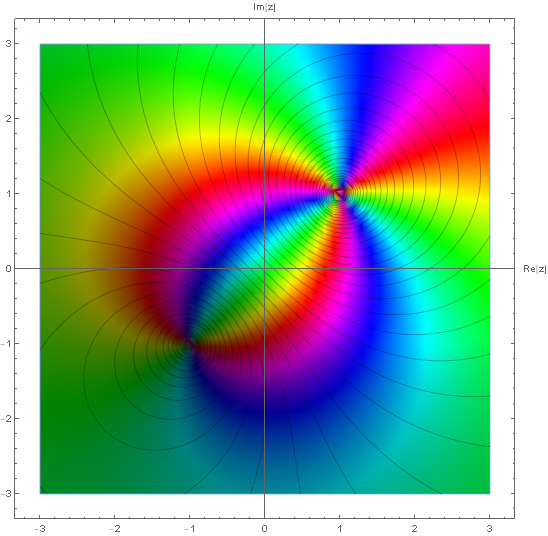

　

$k$ 位の極について $k$ を無限大 $\infty$ にとるとき，その定義を満足する点 $z=p$ を孤立真性特異点という．つまり点 $z=p$ のまわりのローラン展開に於いて，主要部が無限項あるならば，その点 $z=p$ を孤立真性特異点という．

\begin{equation} f(z) = \sum_{n=-1}^{-\infty} a_n (z-p)^n + \sum_{n=0}^{\infty}a_n(z-p)^n \end{equation}

定義から可除特異点でも極でもない孤立特異点が孤立真正特異点である．

#### 分岐点

特異点の位相的な違いによる分類の他に，関数の多価性に着目した特異点があり，これを次のように分岐点とよんで定義している．

複素関数 $f(z)$ が多価関数で，特に点 $z=p$ の周りを周回するとき $n$ 周して元の値になるとき，点 $z=p$ を $n-1$ 位の分岐点という．

分岐点は多葉リーマン面を構成する際の，複素平面の切断の端点となるため，どこであるか求めることは重要である．分岐点はそれ単独で言及した方が見通し良いので，下記の機会に改めて述べることにして，以下では扱わないことにする．

[複素解析での分岐点とは](https://mathrelish.com/mathematics/branch-point-in-complex-analysis)

## コメント

### 可除特異点

可除特異点は可能な限り積極的に正則関数へと近づけていくための特異点として普通は扱われる． 「これが本来議論すべき姿である」というようなある種の研究姿勢を与えるもので，すべての可除特異点を取り除いて議論を始めることが普通である．仮にすべての可除特異点を取り除いたからといって，正則関数になるとは限らないことに注意する．

### 真性特異点

孤立真性特異点は第一種真性特異点とよばれ，また集積特異点は第二種真性特異点ともよばれる． 真性特異点というのは「とにかく扱いづらいもの」というようなレッテルが貼られた特異点で，実解析での邪魔モノと似たような立場にある．

### 無限遠点

無限遠点とは無限大 $\infty$ の空間的な情景のことで，決して手の届かない遥か彼方にある点のことであった．$\infty\notin\mathbb{R}$ であるから，実数の元との二項演算は妥当なものを定義しなければならない．無限大には様々なものがあり，何か一つ決めたらば，その定義に従ってその無限大を取り扱わねばならない．しかし共通して記号は $\infty$ の一つである．これは少し混乱を招く習慣かもしれないが，ここでも $\infty$ を用いる．しかし Riemann 球面のような拡張複素平面を考える場合には $\tilde{\infty}$ と専用の記号を用いる方が親切であろう．

複素解析での無限遠点は射影幾何学と関連が深いものであり，加えて分岐点と同様に単独で言及しても価値がある項目である．この理由のために無限遠点については，必要最小限か感覚的な言及に以下ではとどめ，次に譲ることにする．

[複素解析での無限遠点とは - リーマン球面への立体射影](https://mathrelish.com/mathematics/point-at-infinity-in-complex-analysis)

## 例

### 可除特異点

\begin{equation} f_1(z) = \mathrm{sinc} z = 1 - \frac{z^2}{6} + \cdots \end{equation}

\begin{equation} f_2(z) = \frac{z}{e^z - 1} = 1 - \frac{z}{2} + \frac{z^2}{12} + \cdots \end{equation}

例として $\mathrm{sinc}$ 関数やベルヌーイ数の母関数を挙げた．これらは共通して点 $z=0$ を可除特異点としてもつ．このため次のように再定義して原点を正則にできる．

\begin{equation} g_1(z) := \begin{cases} f_1(z) & (z\neq 0) \\ 1 & (z=0) \end{cases} \end{equation}

\begin{equation} g_2(z) := \begin{cases} f_2(z) & (z\neq 0) \\ 1 & (z=0) \end{cases} \end{equation}

但し可除特異点を除去したからといって，すべての特異点が除去されるとは限らない． 例えば $g_1$ は複素平面全体で除去が成功したので正則関数となるが，一方で $g_2$ は $z=\pm i2\pi k~(k\in\mathbb{N})$ の特異点は依然として存在する． これらのことは次に図示するそれぞれ $g_1,g_2$ についてのプロットからも読み取れる．

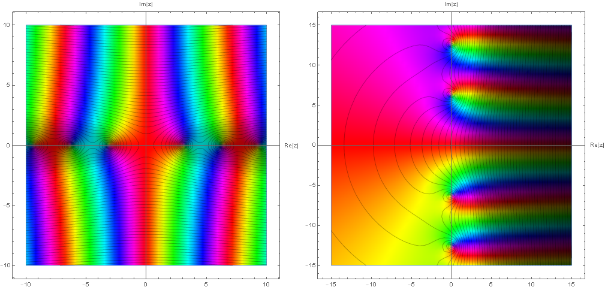

### $k$ 位の極

\begin{equation} f_1(z) = z \end{equation}

\begin{equation} f_2(z) = \frac{1}{z^2 + 1} \end{equation}

\begin{equation} f_3(z) = \frac{z+i}{z^3(z+5)^2(z-19)} \end{equation}

\begin{equation} f_4(z) = \frac{1}{e^z - 1} \end{equation}

これらはそれぞれ以下の極を持つ．

- $f_1(z)$ は点 $z=\infty$ を $1$ 位の極としてもつ．
- $f_2(z)$ は点 $z=\pm i$ の二点を $1$ 位の極としてもつ．
- $f_3(z)$ は点 $z=0,-5,19$ をそれぞれ $3,2,1$ 位の極としてもつ．
- $f_4(z)$ は点 $z=2\pi n i(n\in\mathbb{Z})$ を $1$ 位の極としてもつ．

それぞれについて更に述べたい．

#### $f_1(z) = z$ に関して

無限遠点を極に持つということはリーマン球面と色相環との間の整合性として考えることもできる．

上記の図をリーマン球面へと写せば，この図を下から見た次の図となる．

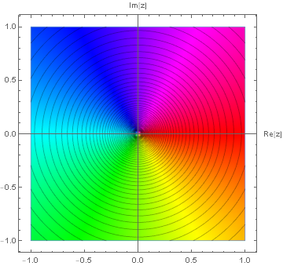

つまり無限遠点について逆象限周りとなる．これは極の性質に他ならない．

#### $f_2(z) = \frac{1}{z^2 + 1}$ に関して

$f_2(z)$ をプロットすると次のようになる．

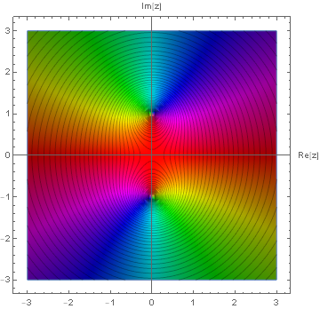

$1$ 位の極が二つあることが容易に見て取れる． これら極は実数直線上にはなく，複素数を考えて初めてでてくるものである． このことは実解析での級数の収束半径について，より深い繋がりを示してくれる．

というのもこの関数とは別に次の関数を考えたとしよう．

\begin{equation} \frac{1}{z^2 - 1} \end{equation}

もしこれを実関数に制限すれば，原点についての級数展開は収束半径が $1$ 未満になる． このことは点 $\pm1$ で特異であることからも大方想像できるものである．

一方で $f_2(z)$ を実関数に制限した場合にも同じように考えると，やはり同じ収束半径を持つことになる．ところがそのグラフを描いてわかるように点 $\pm1$ では有界で特異でない．

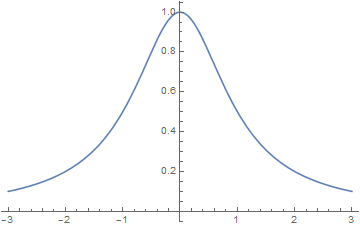

もちろん，級数展開の表式を見れば一目瞭然かもしれないが，この違いを実解析の範囲で直接に，しかも簡潔明瞭に説明することはおそらくできないだろう．事態は原点以外の点で展開する場合を考えると「計算したらそうなる」という感が強くなる．

しかし複素関数へと拡げたことで収束半径が幾何的に明らかになる． 虚軸上の二つある極にぶつかるまで最大限に拡げた半径が正に収束半径となるからである．

#### $f_3(z) = \frac{z+i}{z^3(z+5)^2(z-19)}$ に関して

最低冪が $z=0$ であるから，それをもって $f_3(z)$ は点 $z=0$ のみを $3$ 位の極としてもつといってはならない．

何故ならば，それはローラン展開の一つの代表点に過ぎず，他の点 $z=-5,19$ のまわりでもローラン展開できることは $k$ 位の極の定義文と両立するからである．

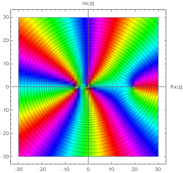

#### $f_4(z) = \frac{1}{e^z - 1}$ に関して

極を持つことの確認は幾らか自明でない．理由は次の通り．

まず点 $z=0$ が何らかの孤立特異点であることは分母がゼロとなることからわかる．そこで $z=0$ のまわりで形式的にローラン展開を実行する．孤立特異点の定義がローラン展開に立脚しているからである．

\begin{equation} f_4(z) = \sum_{n=-1}^{-k} a_n z^n + \sum_{n=0}^{\infty}a_n z^n ~~ (a_{-k}\neq 0 ~,~ {}^{\exists}k\in\mathbb{N}) \end{equation}

この $k$ の値が分かれば，それに応じて孤立特異点の種類が確定する． そこで次の恒等式を利用する．

\begin{equation} \lim_{z\rightarrow 0} \frac{z}{e^z - 1} = 1 \end{equation}

左辺について形式的なローラン展開を代入すれば，

\begin{equation} \lim_{z\rightarrow 0} \left[ \sum_{n=-1}^{-k} a_n z^{n+1} + \sum_{n=0}^{\infty}a_n z^{n+1}\right] = \lim_{z\rightarrow 0} \left[\frac{a_{-k}}{z^{k-1}} + \cdots + \sum_{n=0}^{\infty}a_n z^{n+1} \right] \end{equation}

であるが，これが右辺の $1$ に等しくあらねばならないことから，左辺の最低冪は定数項とわかる．即ちそのような $k$ は $1$ である．従って $f_4(z)$ は点 $z=0$ を $1$ 位の極としてもつのである．

以上のことは $z=2\pi n i(n\in\mathbb{Z})$ についても同様であり，プロットすると虚数軸に極が並んでいることが読み取れる．

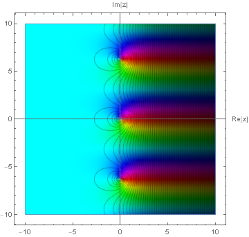

### 孤立真性特異点 (第一種真正特異点)

\begin{eqnarray} f(z) &=& e^{\frac{1}{z}} = 1 + \frac{1}{z} + \frac{1}{2!z^2} + \cdots + \frac{1}{n!z^n} + \cdots \\ g(z) &=& e^{z} = 1 + z + \frac{1}{2!}z^2 + \cdots + \frac{1}{n!}z^n + \cdots \end{eqnarray}

$f(z)$ は点 $z=0$ を孤立真性特異点としてもつ．$g(z)$ は点 $z=\infty$ を孤立真性特異点としてもつ．

真正特異点は位数が無限大の極でもあるため，複素関数のプロットは壮絶である． 次は何れも $f(z)=e^{\frac{1}{z}}$ のプロットになる．

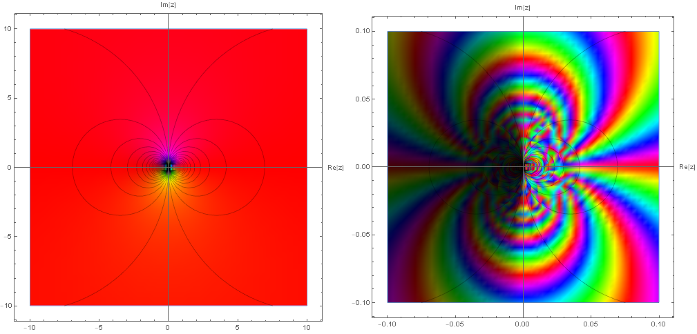

左は広域をプロットしたものであるが，極の周りを単一色で埋め尽くしている． このことは $z=re^{i\theta}$ と置くとわかる．

\begin{equation} f(z) = e^{\frac{\cos\theta}{r}} e^{-i\frac{\sin\theta}{r}} \end{equation}

これからどの方向についても原点から遠ざかるほど，偏角部分は $0$ へと $\frac{1}{r}$ の勢いで近づいていく．こうなると $\sin\theta$ の振動部分は $0$ のごく近くで振動するのみで影響の小さいものになる． よってプロットは赤一色に染まることになる．

右はより原点に近い領域をプロットしたものである． 幾重にも偏角が変化している様子が垣間見れる． そして左半平面が暗く，また対照的に右半平面が明るくなっている． 特異点である原点を境に急激に大きさが変化していることを示唆している． 実際，特異点である原点では収束が一意になっていないことが次のようにわかる．

\begin{equation} |f(z)| = e^{\frac{\cos\theta}{r}} \end{equation}

これから虚軸に沿って原点に近づくと $1$ になるとわかる．

\begin{equation} \lim_{z\rightarrow 0}|f(z)| = \lim_{z\rightarrow 0}e^{\frac{0}{r}} = \lim_{z\rightarrow 0} 1 = 1 \end{equation}

しかし虚軸から少しでもずれると $\cos\theta$ の符号が負であるか正であるかで，それぞれ $0$ と $\infty$ へと収束することになる．

\begin{equation} \lim_{z\rightarrow 0}|f(z)| = \lim_{z\rightarrow 0}e^{\frac{\mathrm{sgn}(\cos\theta)}{r}} = \begin{cases} 0 & \left( \frac{\pi}{2} < \theta < \frac{3\pi}{2} \right) \\ \infty & \left( -\frac{\pi}{2} < \theta < \frac{\pi}{2} \right) \end{cases} \end{equation}

このような高低差をより際立たせるためには大きさを高さとして表現した次のプロットが役立つ．

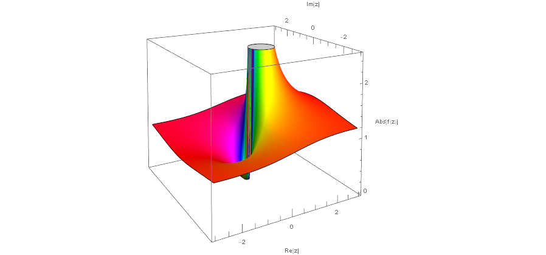

### 集積特異点 (第二種真性特異点)

\begin{equation} f(z) = \csc \frac{1}{z} \end{equation}

$f(z)$ は点 $z=0$ を集積特異点としてもつ．何故ならば $f(z)$ は他に点 $z=\frac{1}{n\pi}(n:=\pm1,\pm2,\cdots)$ を $1$ 位の極としてもつので，$n\in\pm\mathbb{N}$ より，それら $1$ 位の極は点 $z=0$ の周りに $\aleph_0$ の濃度で無数に存在する．

それ故，特異点 $z=0$ を中心にどんなに小さい円を描いても，その内部に特異点 $z=0$ 以外のそれら特異点が含まれるからである．

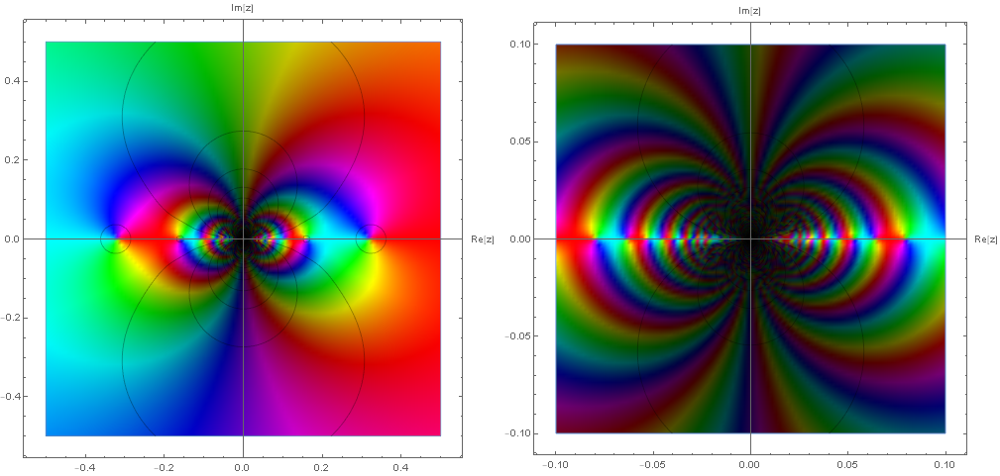

上図の左は原点から最も遠い特異点 $\pm\frac{1}{\pi} \simeq \pm 0.31831$ が見えるほどのスケールでのプロットであり，右はより原点付近のみにスケールしたプロットである． 逆象限周りに一周しながら原点へと特異点が集積していっている様子が確認できる．

## 参考

[複素解析 (複素関数論) – オススメの参考書](https://mathrelish.com/mathematics/recommended-books-in-complex-analysis)

- [ヴィジュアル複素解析](https://amzn.to/2Qpkphs)
- [Visual Complex Functions: An Introduction with Phase Portraits](https://amzn.to/3avRz91)

