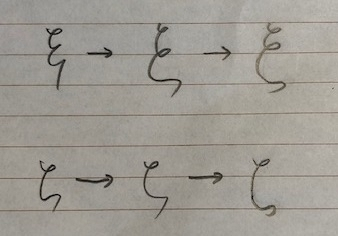

# 数式がある文書作成に役立つ資料まとめ

なかなか上手い表題を考えるのが難しかったのと， 置かれた状況によって「役立つ」の尺度が変わる． また技術文書に限るものでもないように思ったので， 単に文書とした．

なんとも正確ではないが， 何も知らずに数式を書き連ねていくよりはよいだろうということで， この表題で本稿を書くことにした．

ご容赦願いたい．

## はじめに

今やテクノロジーは高度に進化して， 様々な分野で数式を用いたコミュニケーションが必須となっている． しかし一方で数式と聞いて，その「書き方」に関して注意が払われることは意外に少ない．

### 清書する！

普段，数式に馴染みのある人でも，以下の時間が大部分を占めるのではなかろうか．

- 計算用紙に式を書く
- (宿題などの)レポートを書く
- 板書する

これらはそれこそ学生や教員の垣根なく，日々体験していることだろう． だが次の機会がそうそうない．

- 清書する

これは「不特定多数の人に向けて投稿する」と読み替えてもよいだろう． 気心の知れた中でのコミュニケーションと違って， 外部の人を意識したものである．

そのような場合での数式がある文書の書き方となると， おそらく断片的に学ぶ機会しかないのが大多数ではないだろうか． 運良く世話好きの教授に巡り会えて教えてもらうくらいだろうか．

以下では偶然性にかけるよりも， 幾らかは「清書」に近付けることが望めそうな資料をまとめるものである．

### $\TeX$ の利用について

清書する以上は $\TeX$ の利用が不可避になろうかと思うが， そうなると $\TeX$ の使い方に重きを置いた資料の紹介になりがちである． それはそのとおりな側面はあるわけだが，少し調べればたくさん出てくるので， ここではあまり触れないことにする． 以下の本文と重複はあるが定番を以下に列挙しておこう． 但し書かれていることが全て正しいとは限らないのがこの界隈の難しいところ． 努々忘れるなかれ．

- [[改訂第8版]LaTeX2ε美文書作成入門](https://amzn.to/3puWL3K)
- [LaTeX2ε辞典 増補改訂版](https://amzn.to/3aRQawk)
- [数学論文の書き方](https://www.jstage.jst.go.jp/article/sugaku1947/39/3/39_3_276/_article/-char/ja/)
- [数学論文の書き方(英語編)](https://www.jstage.jst.go.jp/article/sugaku1947/39/4/39_4_348/_article/-char/ja/)
- [数学の常識・非常識—由緒正しいTEX入力法](http://www.math.tohoku.ac.jp/tmj/oda_tex.pdf)
- [TeX講習会資料](http://iso.2022.jp/math/texintro2016/resume.pdf)
- [An Introduction to LaTeX and AMS-LaTeX](http://ftp.jaist.ac.jp/pub/CTAN/info/mil/mil.pdf)
    
    - [Comprehensive TEX Archive Network](https://ftp.kddilabs.jp/CTAN/) の [info](https://ftp.kddilabs.jp/CTAN/info/) を漁ると吉
- [好き好きLaTeX2e](http://mytexpert.osdn.jp/index.php?%B9%A5%A4%AD%B9%A5%A4%ADLaTeX2e)
- [文献管理ソフトの比較表](https://en.wikipedia.org/wiki/Comparison_of_reference_management_software)

|  |  |
| --- | --- |

2020 年以降で出版された入門書としては次がおすすめである．

- [LaTeX超入門 ゼロからはじめる理系の文書作成術 (ブルーバックス)](https://amzn.to/2VxMuKI)

## Mathematical Notation: A Guide for Engineers and Scientists

本書は約80ページほどで非常に薄いが，カバーしている範囲は広い． 超幾何級数や $q$-類似，可換図式など， 初等的な範囲に限らない構成になっている．

巻末には本書に登場したシンボルについて $\LaTeX$ の記述例が表でまとめられており，利便性も高い．

値段も手頃で清書を始めてみる最初の一冊に適しているし， サッと調べるのにも非常に優れている．オススメだ．

- [Mathematical Notation: A Guide for Engineers and Scientists](https://amzn.to/3mY9Tgj)
- [著者サポートページ](https://www.ams.jhu.edu/ers/books/mathematical-notation/)

## 数学文章作法 基礎編 & 推敲編 (ちくま学芸文庫)

|  |  |
| --- | --- |

数学ガールで有名な[結城浩](https://www.hyuki.com/)氏による実践的な指南書である． 氏の著作活動は既に50冊を超える． どうすれば読みやすくなるか，これは取りも直さず， 売れることに直結する話題であるし，言ってみれば死活問題である．

この手の本で定番なのは『[理科系の作文技術](https://amzn.to/3mZjF1B)』や『[日本語の作文技術](https://amzn.to/2WV9PDl)』だが，数学に特化しているかというとそうでもなく，まぁちょっと物足りないかなぁというところではないだろうか．

数式や数学に関係する事柄を誰かに伝えたい場合， その欲求にそっと寄り添ってくれるような本として， 本書をオススメしたい．

現役の著者が普段どのようなことを考えて執筆しているのか， そういうところも感じ取れて面白いのではないだろうか．

- [数学文章作法 基礎編 (ちくま学芸文庫)](https://amzn.to/3mXfKCr)
- [数学文章作法 推敲編 (ちくま学芸文庫)](https://amzn.to/3aQr94w)
- [理科系の作文技術（リフロー版） (中公新書)](https://amzn.to/3mZjF1B)
- [<新版>日本語の作文技術 (朝日文庫)](https://amzn.to/2WV9PDl)

## 数式組版

プロの視点で数式の組版について書かれた貴重な一冊．

$\TeX$ は数式組版の一つの手段に過ぎない． そもそも数式が絡む組版とはどのようなことなのかを 豊富な例を交えて一つ一つ丁寧に解説した書籍で， その理解を通して，$\TeX$ でこう書くべきか， というような意識が芽生える本である．

誰かが言っていたから，ここはこうしている，というような， プログラミング言語で言うところの「おまじない」とか， 根拠なき我流のようなものを払拭するにはとても良い本であろう．

組版の用語を理解していけば，数式ないしは数学的意味を伝える， という側面が強化されるという効果もある． (それが大きいというか主たることかな)

本書に早期に出会うことで， 下手な癖が付いたり独り善がりの思想が芽生えることを 未然に防ぐことができ，必読の一冊と言えよう．

- [数式組版](https://amzn.to/38OcILC)
- [数式組版 (出版元サイト)](https://www.lambdanote.com/collections/frontpage/products/mathtypo)

## 学会関係

基本的に各学会の規定通りに書くことを目指せば良い． 「清書する」の多くはこのためにあるようなものである．

### 日本数学会

日本の歴史ある学会として，1947年創刊の日本語機関誌『[数学](https://mathsoc.jp/publication/sugaku/)』を挙げてみよう． このページには次のドキュメントがあり， およそ最低限度の礼儀のようなことがまとめられている． 参考文献についても「まぁ知っていないとね」というものが挙げられており， とりあえず見ておいても良いかなと思う．

その参考文献 (の一つ) とは『[数学の常識・非常識—由緒正しいTEX入力法](http://www.math.tohoku.ac.jp/tmj/oda_tex.pdf)』のことである． いつリンク切れするかわからないので， その場合はこの名前でググってもらうか， 落としておくとよいだろう． 有名だが，勿論，書いてあることが全て正しいとは限らない．

- [数学原稿の作り方](https://mathsoc.jp/publication/sugaku/sugaku-kitei2017.pdf)

### AMS Style Guide: Journals

AMS とはアメリカ数学会のことで，最近では [MathJax](https://www.mathjax.org/) の開発元で世間では有名かもしれない． まぁ [amsmath.sty](https://www.ctan.org/pkg/amsmath) でお馴染みなわけです． こちらでは以下のページから[スタイルガイド](http://www.ams.org/arc/styleguide/AMSstyleguide.pdf)がダウンロードできるようになっている． 言ってみれば世界標準のようなものなので， これを早いうちから読みこなしておくことが最短かもしれない．

- [AMS Style Guide: Journals](http://www.ams.org/arc/styleguide/index.html)
- [はやわかり LATEX で数式組版](https://www.latex-project.org/help/documentation/short-math-guide_jpn.pdf)

## ISO 80000-2

[ISO 80000-2](https://ja.wikipedia.org/wiki/ISO_80000-2)

実は ISO (国際標準化機構) に数学記号のセクションがあるのだが， これを知る人は少ないかもしれないし， 「この数式は ISO 規格に則ってるよ」と言ったり言われたりする場面に 出くわすなんてことは，そう滅多にあることではない．はず．

とはいえ，一見の価値はある．

例えば「$:=$」を定義等号として用いることが ISO 規格として定められている． 定義等号はかなり表記揺れが激しく，$=$ の上に $\Delta$ を乗せた等号を定義等号として用いる場合があったり，分野や著者によってかなり独特な作字が用いられがちである． そんな中「$:=$ は ISO 規格ですよ」とか言ってみると丸く収まるかもしれない．

個人的には $\equiv$ を使うのは好きではない． $:=$ が好みである．

- [ISO 80000-2](https://ja.wikipedia.org/wiki/ISO_80000-2)

## A History of Mathematical Notations (Dover Books on Mathematics) (English Edition)

ある程度，いろいろと数式をいじっていると， 既存の記号・記法では満足できなくなってくる時が来る． その理由は様々であろう． もっと効率的でありたいとか，重要性を強調したいとか，などである．

そこでオリジナルの notation を何かしら考えるわけだが， これまで人類が同様のことをどのようにやってきたのかという歴史を踏まえて作業すると， 新たな発見やより良い案が思い浮かぶ機会が得られることだろう．

勿論，そういう意図だけで推薦するわけではないが， 本書はこれまでの古今東西の人類が編み出してきた数学記法の歴史をまとめたもので， 下手に誰かに聞いたりググるよりも，遥かに正確に歴史を紐解くことができる．

なお本書は 1928 年発行で 1930 年に没する Florian Cajori の最後の著作であるため， 本書がカバーするのは1920年代までとなり，それ以降については何とかして自分で調べる必要がある． また今後どのように発展していくのかとか，言語理論に基づいた考察など探せば， このような[文献](https://web.wpi.edu/Pubs/E-project/Available/E-project-110815-204313/unrestricted/notation.pdf)など幾つかあって，参考になろう．

- [A History of Mathematical Notations (Dover Books on Mathematics) (English Edition)](https://amzn.to/3mYd1bG)
- [An Analysis of Mathematical Notations: For Better or For Worse](https://web.wpi.edu/Pubs/E-project/Available/E-project-110815-204313/unrestricted/notation.pdf)

## Triangle of Power

[embed]https://www.youtube.com/watch?v=sULa9Lc4pck[/embed]

本動画では指数表記・対数表記・ルート表記を統一的に表記しようとする試みを紹介している． これら表記は全く異なるものの，考えようとしていることに本質的な差はない．

もうだいぶ月日が流れて今更表記を改定することは無理というか無茶な話だが， ひょっとしたら宇宙のどこかでは， 提案されている表記法が当たり前のように使われているかもしれない．

- [Alternative notation for exponents, logs and roots?](https://math.stackexchange.com/questions/30046/alternative-notation-for-exponents-logs-and-roots)

TeX で使用したい場合には次を参照するとよい．

- [How to represent the "Triangle of Power" in LaTeX?](https://tex.stackexchange.com/questions/307833/how-to-represent-the-triangle-of-power-in-latex)

## チャールズ・バベッジの表記法("Notation") について(数学史の研究)

計算機分野で有名な Babbage による記法の11規則

1. 単純であること
2. 一意であること
3. 既存の記号と類似する場合は関連が密接であること
4. 不用意に増やさないこと
5. 逆演算は何であれ指数に $-1$ を付した同一の記号であること
6. 等式は規則を明示するものであること
7. $n$ 回繰り返す演算は $n$ の明らかな関数として記述すること
8. 法則を表現できるほど一般的なものの記号であること
9. 量はイタリック体，演算はローマン体であること
10. 関数記号はまるでそれらが一つの文字を構成するかのように，後に続くすべての記号に作用すること
11. 暖昧にならなければ， 括弧は省略してもよい

かなり，現代に近い約束事ばかりであるが，1822 年のことである． 歴史を知らないと，これまでに何度か同じような気運があったことを知らずに 舞い上がってしまうところである． 数学史研究 (広くは科学史) が盛んになってほしいと思うばかりである．

- [チャールズ・バベッジの表記法("Notation") について(数学史の研究)](https://repository.kulib.kyoto-u.ac.jp/dspace/handle/2433/80781)
- [19世紀における論証的規範の転換 --Lacroix を case study として--](https://www2.tsuda.ac.jp/suukeiken/math/suugakushi/sympo02/2_10mizutani.pdf)

## Mathematical Notation: Past and Future (2000)

Wolfram による数学記法の過去と未来に関する投稿． 彼は古代文明から順に現代まで Mathematica で当時の記法を再現しつつ， その経緯や長所短所といったことを資料を交えて， どのような発展を遂げてきたのかをレビューしている．

いつもながら長文なので，読むのに骨が折れるが， その発展を前提にコンピュータで処理するためにどのように取り組むべきか， そういったライフワークを垣間見ることができる．

数式検索という話題は今でも面白いなと思ったものである． なお現時点で数式検索可能なオンラインサービスに [Search on Math](https://www.searchonmath.com/) がある．

- [Mathematical Notation: Past and Future (2000)](https://www.stephenwolfram.com/publications/mathematical-notation-past-future/)
- [Antique Notation](https://www.notebookarchive.org/antique-notation--2018-10-0yfrsz2/)
- [[The Reform of Mathematical Notation] Computation, Mathematical Notation, and Linguistics](https://content.wolfram.com/uploads/sites/39/2015/02/MathematicalNotation-SW.pdf)

## From Scribble to Readable

[37 種の数学シンボルの書き方が学べる本の紹介](https://mathrelish.com/mathematics/from-scribble-to-readable-introduction)

上記でも個別に記事を作成して紹介したものだが， 手書きでの清書も美しくありたいものである．

練習に一冊いかがだろうか． 私自身，$\xi$ や $\zeta$ がキレイに書けるようになった．

一番左が私の元の字で，今見るとかなりひどい． 中央が何回か練習して書いた字で，特徴を掴みだしている． 一番右が書き方見本にかなり寄せれてたと思っている字である．

カタカナに初めて触れた人が， 「ソとン」，「シとツ」のような書き分けに難儀する気持ちがよくわかる．

- [『From Scribble to Readable』の購入サイト](https://fromscribbletoreadable.com/)
