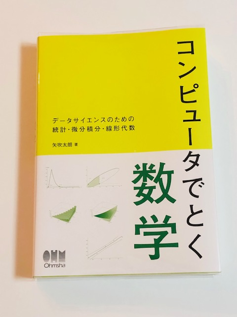

# 技術書典 16 出店参加レポート

去る 2024-5-26 に第十六回目を迎えた技術書典にオフライン参加してきました． 技術書典には過去，2 回参加しており，これで 3 回目です． ですが実質的にはコロナ禍のために 2 回目の参加です．

- [技術書典 6](https://techbookfest.org/event/tbf06)
    
    - [参加レポート](https://mathrelish.com/original-goods/techbookfest-6)
- [技術書典 8](https://techbookfest.org/event/tbf08) (コロナ)
- [技術書典 16](https://techbookfest.org/event/tbf16)

## 思い出されるコロナ禍

コロナ前に実は技術書典も含めた複数の即売会を想定して， 既刊を多めに刷ったのですが，すべての即売会が中止となって， 見事にすべて在庫に代わってしまいました． その始まりが技術書典 8 だったのです．

救いは，なんとなく中止が発表される前に， コロナが少なくとも２～３年は落ち着かないのではないかと考え直すことができて， 新刊は刷らずに電子版だけ作ることにしました．

大した営業力はありませんから，やはり即売会が重要なわけです． 結果，当時の新刊である [MRJ5](https://mathrelish.booth.pm/items/1874917) だけ電子版のみが存在しています． いつか少部数だけでも刷ろうとは思っていますが，まぁいつかですね．

[The Math Relish Journal Volume 5 (BOOTH)](https://mathrelish.booth.pm/items/1874917)

## 技書博から技術書典へ

今回は技書博と技術書典の間が二週間ほどでしたので， 正直なところ技書博で力尽きた感がありました．

技術書典はほとんど宣伝しておらず， 技書博では間に合わなかった新刊の電子版作成に注力しました． TeX で作っているので，さほど大きな作業量ではありませんが， 深夜作業になりますから，二週間はまぁ妥当な期間でした．

## 当日

今回もお隣の出店者様と挨拶を交わし，設営スタート！

で，さっそく，QR コード読み取りの台紙を逆方向に折って破いてしまいました． スタッフの方に予備をいただいて事なきを得ました．ありがとうございます．

### エンジニアは朝に弱い？

会場が広いのか，２回目で慣れてしまったのか， 始まってみると人通りはそれなりにある，というものでした． コミケのようなごった返しというわけでもなく，かといって決して少ないわけではない． 人通りは定常流ではなく，定期的にパルス波を感じさせるものでした．

ただなんとなくですが，午前中よりも午後から立ち寄っていただける方が多くなっていったような気がします．

### またも完売！！！！！！

今回の新刊はそもそも部数が少ないのですが， 予定していた当日分は午後の早いころに捌けることができました． そのあと，通販分も投入しましたが，一冊を残してすべて頒布できました． その残った一冊も翌日早朝に売れましたので，完売ということで一安心しました．

↓新刊↓

[The Math Relish Journal Volume 6 (技術書典)](https://techbookfest.org/product/fz3uk4p5crqyGvA0t3r7rn)

[The Math Relish Journal Volume 6 (BOOTH)](https://mathrelish.booth.pm/items/5738559)

正直なところ，大部の本は値段も高めにならざるをえず， また微分記号とか，ありそうでないようなテーマではありますが， 果たして刺さるのかと・・ ま，そもそも界隈では炎上しがちなテーマでもあり，精神的な勇気が多分に必要ではありました．

## サークル間交流

基本，陰キャなわけで， あまり自分から関わりを持つのが難しい，めんどくさいサークル主ですが， 今回は少し余裕もあって，いくつか気になっていた方のブースにお邪魔したりしました． また隣におられたサークル様とも帰り際に，交流ができて， 実は私がずっと以前から気づけていなかったかもです．．．

もっとフランクになれればといつも思うところですが，これが限界でした． なんかすみません．． でも少しのお時間ではありましたが，お話しできて，本当に楽しかったです． お相手していただきありがとうございました．

* * *

陰キャといえば，このマンガが面白いです．

- [ポンコツ魔王の田舎暮らし](https://amzn.to/3RlbMFD)

## 国立国会図書館，納本編，開幕？

矢吹先生のポストを発見！！

[embed]https://x.com/yabuki/status/1799087990872109232[/embed]

矢吹先生といえば，この黄緑本『コンピュータでとく数学』． (カバーをとると完全に黄緑色！)

- [コンピュータでとく数学: データサイエンスのための統計・微分積分・線形代数](https://amzn.to/3KzjXKJ)
    
    - [サポートサイト](https://github.com/taroyabuki/comath)

何れもお読みになられた方は，黄緑本と今回の[新刊](https://mathrelish.booth.pm/items/5738559)とが， 中身は全く別物ですが，なんとなく似ているのではないかと思われるかもしれません． 私自身，そう思ったからです．

新刊ではほんの少しだけ Wolfram 言語への言及がありますが， これはいろいろとコードを実例に「計算機が曖昧さなく解釈できる表記方法」というのを 強調したかったところにあります．

黄緑本ではそれが完全に実現できていて， しかも大学教養範囲に焦点を絞っており， 共通言語ともいうべき教養数学について澄んだ理解を整理するという点で理想的です． 加えて Wolfram 言語だけでなく，Python，R まで並列に例示しています．

副題に『データサイエンスのための～』とありますが， あえて言えばこれはもったいない．理工系全体ではないでしょうか． と思っていたのですが，早とちり！

> 副題は，自然科学だけでなく，社会科学の学生にも買ってもらおうと思って付けました． https://x.com/yabuki/status/1801266866209611996

とのことです．

た，確かに！[文部科学省|15 分類表](https://www.mext.go.jp/a_menu/shinkou/hojyo/05090101/004/pdf/017_2.pdf) にもありますように， いわゆる，理工系だけでなく，社会科学系の方々にも，私もぜひ読んでほしいと思いました．

[データサイエンスと社会科学](https://ocw.tsukuba.ac.jp/data-science/social_science/)を見るだけでも，計算機というツールを使わない手はないわけです．このツールの威力に気づいた人は，黄緑本が習熟のためのクリティカルパスを与えてくれるのではないかと思います．

* * *

さて，同人活動を続けているとおよそ必ずどこかで発生するイベントが， 国立国会図書館への納本イベントです．

実は [MRJ1](https://mathrelish.booth.pm/items/1123647) を作って以来，何度か検討はしたんですが， ついにアタックする日が来たということでしょう． 郵送すれば済む話ですが，せっかくですので，現地手続きを体験しに行きたいと思います！
