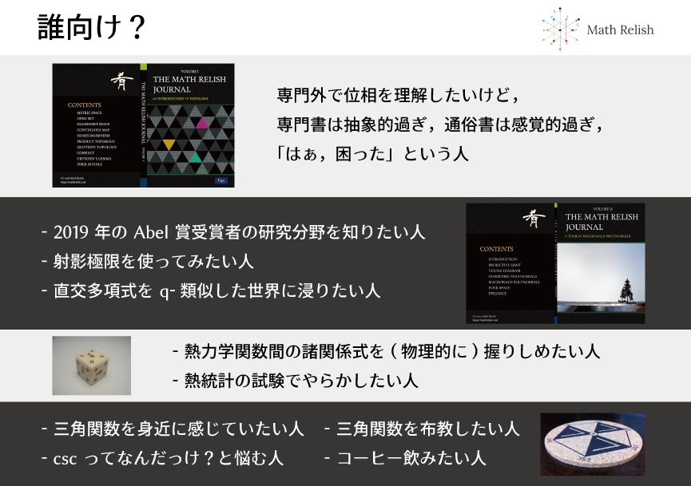
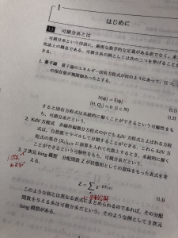
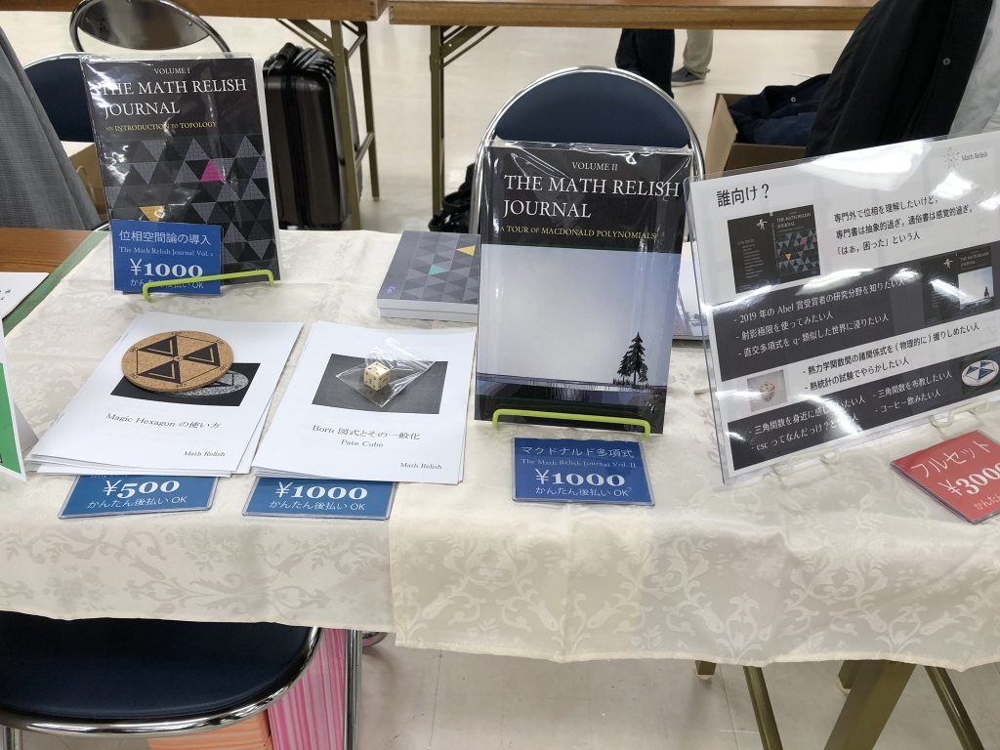

# 技術書典 6 出店参加レポート

去る 2019-4-14 に第六回目を迎えた技術書典に参加してきました． 技術書典は新しい技術に出会える「お祭り」ということで， 終始，ワイワイガヤガヤしている時空でした．

## 準備とか

### 参加申込とスケジュール

| 時期 | 内容 |
| :-- | :-- |
| 2019-1-6 から 2019-1-31 | 参加申込，印刷用サークルカット締切 |
| 2019-2-5 | 当落通知 |
| 2019-2-12 | 参加費入金締切 |
| 2019-2-20 | 配置発表 |
| 2019-3-17 | 一般参加書向け正式サイト公開 |
| 2019-4-10 | 見本誌提出締切 |
| 2019-4-14 | 技術書典当日 |

大きな節目はこんな感じでした．

知り合いからこう漠然と質問されたことが参加のきっかけでした．

> 「なんで技術書典に参加しないの？」

(まぁ，なんでと言われても．．．)

という感じで，コンテンツが理学書メインのため，そもそも参加してええんかいな，という無意識の心理的障壁が大きかったように思います．

とはいえ，そういったジャンルも幅広く受け付けていることを知り，「いっちょやってみっか」ということで参加申込をしました．

このとき，サークルカット締切をよく理解しておらず，さぁ，ちゃんと作るかというときには，時すでにお寿司でした．

### 真の新刊作成

C95 で頒布した分も一応，技術書典では新刊扱いでしたが，ちょっとそれだけではどうかなと思い，真に新刊となるよう一冊新たに作成することにしました．本当は二冊作ろうと思ったのですが，途中で挫折．

で，最終的にできたのが↓です．

[The Math Relish Journal Volume 2](https://mathrelish.com/original-goods/the-math-relish-journal-volume-2)

執筆しだしてから，偶然にも数学セミナーの特集記事が発売されたり，更には Abel 賞に Uhlenbeck 氏が受賞するなど，これはひょっとして可積分系が世に問われているのか？？？と一人勝手に盛り上がっていました．

昨今，数学・物理の就職状況といいますか，一昔前は金融や教職など商業テクノロジーとは縁遠いイメージがありましたが，ソフトウェア業界にも多量に人材が流れているように思います．一向に改善の兆しを見せないポスト難もあり，将来の教授候補ですら社会にでることも珍しくなくなりました．その是非は置くとしても，これまで以上に数式への抵抗感は格段に下がってきていると個人的には感じています．

そこへ来ての量子可積分系です（えっ？！）．なるべく多くの方々に次のことを知ってもらおうとしました．

- マクドナルド多項式とは何ぞや
- 有限と無限の繋がり
- ヤング図形
- q-類似

特段，生活するのに必要のない知識ですが，これらの話題がそれこそ 19 世紀から脈々と続いていることを味わっていただければと思っています．

### 設営道具

ダイソーでスマホスタンドなどの小道具を購入して，設営道具を揃えました． カードケースは値札入れにうってつけでした．

また当日のために，お品書き↓を書きました．

こういうの作っているときが楽しかったですね．

### 出稿まで

#### 作り方勉強会

当日までに技術書の作り方勉強会も催されており，包括的な展開に本気度が感じられます．

[技術書典6 技術書の作り方勉強会 ～執筆環境をワイワイはなそう～](https://techbookfest.connpass.com/event/120811/)

私は普段の生活に余裕がなく，参加できなかったのですが，機会があれば参加してみたいです．

#### 赤入れとか

今回は新刊作成の時間がとにかくなかったので，本文は TeX で，表紙はイラレと，C95 と同じ環境で作成しました．また内容も割り切るところは割り切って，可能な限り (一つの) 筋道がわかるように推敲することに時間を割きました．表紙はマクドナルド多項式を寒い冬の中で語っていたことを思い出しながら書きました．

また印刷は今回も STARBOOKS さんに依頼しました．

[STARBOOKS](https://www.starbooks.jp/)

おそらく今後も依頼することになるかなと思います．

推敲で私自身強くオススメしたいのは実際に「見開き印刷」してみて，赤ペンでアレコレ書いていくことです． いわゆる赤入れですね．まぁ，自分にあっている方法が一番なんですが．

赤入れをしていると，他人になった気分になれるのが大きかったように思います．

## 当日

お隣の出店者様と挨拶を交わし，設営スタート！

### 驚異の販売スピード

なんやかんや言っても，一，二時間経ってようやく一つ売れるかなぁ・・と身構えていたのですが，十分かそこらで位相空間論のジャーナルが売れました．こっからが凄かったです．徐々に売れるスピードが上がっていって，お客様へのご対応が追いつかなかったです．

といった経験をしてみたかったので，もうそれだけで参加して嬉しかったですね．

### 止まらない人の流れ

午後になるとだいたい落ち着いてきて，午後三時には撤収かなぁとかフワフワ考えていました．

しかし全く違いました．

全く入場者が途切れないのです． これにはお隣の出店者様とも驚きを共有していました． コミケと違って客層がハッキリしているので，数学書でも全然通用して，技術書典の熱気の凄さを肌で感じました．

### 完売！！！！！！

技術書典が終わる前にジャーナル Vol.1, Vol.2 が完売してしまいました． 割と在庫がたくさんあった位相空間論の方から完売して驚きました． 幾多の予想が外れているので，私はとことん商売に向いていないようです． このときネット販売用も売り払ってしまったので，Booth では今後電子版の通販に切り替えていくことになりました．もうとにかく売れて売れて (ようやく元を返した)，位相やマクドナルド多項式が世に広まっていくんだなぁという思いに浸れました．

## 終わってみて

もう，参加してよかったの一言です．

### 電子版創刊！

心残りはせっかく来ていただいたのに完売となって頒布できなかったことです． そこで急遽，電子版も下記にご用意いたしましたので，どうかご了承くださいませ． 書籍版はイベント参加時に (おそらく少部数) 刷りたいと思います．

[The Math Relish Journal Volume 1](https://mathrelish.booth.pm/items/1123647)

[The Math Relish Journal Volume 2](https://mathrelish.booth.pm/items/1244077)

皆様，本当にありがとうございました！！
