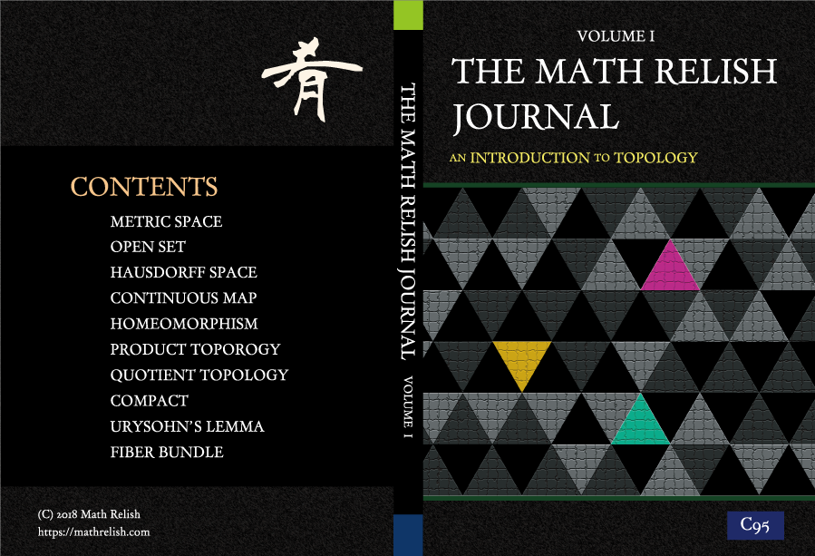
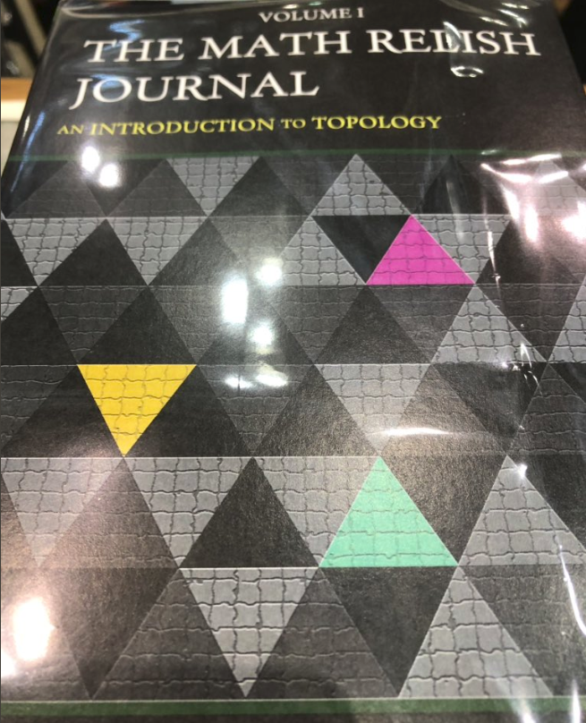
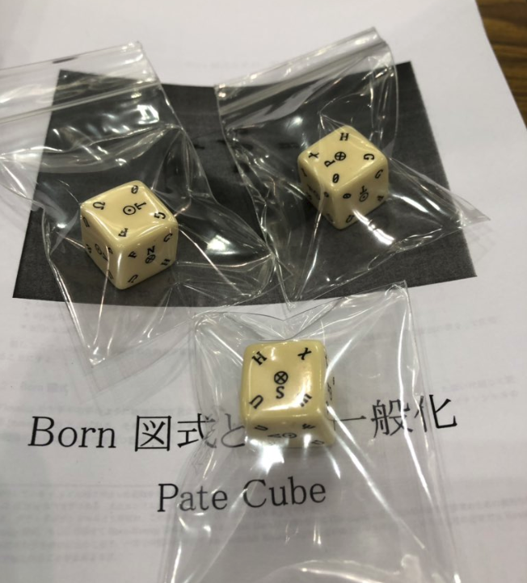

ジャーナル創刊！

## 創刊にあたって

Math Relish のジャーナル (定期刊行物) を C95 で創刊しました．

[The Math Relish Journal Volume 1](https://mathrelish.booth.pm/items/1123647/)

### 動機

日々の活動の総合報告を定期的に発信していけたらいいな，というのが根底にあります． Web は Web の良さがあるのですが，単純に一冊の本として仕上げることが楽しいということもあります．

### 方針

記事について下記の方針を努力目標にします．

- ジャーナル化した Web 上の記事は誤字脱字などの軽微なものは適宜修正します．
- 意味内容の誤りは書籍は正誤表を作成した後で，Web も合わせて修正します．ある程度の大きさがある誤りについては記事を別に設けるなどします．もし版を重ねることができれば，書籍・Web ともにマージします．
- 意味内容の精密化に関わる追記の類いは Web では一切行わず，それらは別記事として扱います．
- (Web の内容) $\subset$ (書籍の内容) という包含関係が段々と成り立っていきます．

どこまでできるかわからないので，あくまで努力目標です．ごめんなさい．

## An Introduction to Topology

今回は創刊ということで既に Web 上に掲載している位相空間論と，その理解に必要な最低限の集合論と論理を編成したものになっています．なお今回はすべて同じ内容を Web で閲覧できますが，今後はその限りではないように調整していきます．

[販売ページへ](https://mathrelish.booth.pm/items/1123647/)

### 仕様

ペーパーバック，A5，142 ページ

### 内容紹介

#### 概要

位相空間論の基本的な事柄を取り上げます． 位相は距離や連続性の抽象概念であり，数多ある豊穣な理論の基礎論理を支えています． 反面，専門課程を経ていないと著しく表層的な理解にとどまる恐れのある分野ともいえます． 本書がその道先案内の助けや知的な会話の肴になるならば幸いです．

#### 本論

1. [距離空間](https://mathrelish.com/mathematics/metric-space)
2. [開集合とは](https://mathrelish.com/mathematics/open-set)
3. [ハウスドルフ空間とは](https://mathrelish.com/mathematics/hausdorff-space)
4. [連続写像とは](https://mathrelish.com/mathematics/continuous-map)
5. [同相写像とは](https://mathrelish.com/mathematics/homeomorphism)
6. [積位相とは](https://mathrelish.com/mathematics/product-topology)
7. [商位相とは](https://mathrelish.com/mathematics/quotient-topological-space)
8. [コンパクトとは](https://mathrelish.com/mathematics/compact)
9. [ウリゾーンの補題とは](https://mathrelish.com/mathematics/urysohns-lemma)
10. [ファイバー束とは](https://mathrelish.com/mathematics/fiber-bundle)

#### 付録

1. [対応と写像とは](https://mathrelish.com/mathematics/correspondence-and-map)
2. [同値関係とは](https://mathrelish.com/mathematics/equivalence-relation)
3. [前提命題が偽ならば全体の命題は真とは](https://mathrelish.com/mathematics/implication)

## C95 現地レポート

C95 は平成最後のコミケでした． せっかくですので，それまでを簡単にレポートしたいと思います．

### DTP

#### 本文

本文は TeX ですべて乗り切りました．

TeXLive が安定化してからというもの，恐ろしく TeX は敷居が下がりました． 加えて PDF で成立していれば，それだけで製本が可能になり組版の敷居もすごく下がったと思います．

TeX は歴史の重み故に，「？？」な仕様もあったりしますが， 痒いところに手が届くのは (私の場合) TeX しかなく，DTP は TeX にしました．

#### 表紙

イラレ (Adobe Illustrator) で作りました． 表紙はどこで印刷してもらうかで，テンプレートが変わるので，まぁ，必然的にそうなりますね．

今回，印刷は STARBOOKS さんに依頼しました．

[STARBOOKS](https://www.starbooks.jp/)

良 UI の価格シミュレーションと自由度の高いカスタマイズで，すごく助かりました． 早期での割引やら，ジャギーの確認など製作者の目線に立ったご対応をしていただきました． 私個人としてはとってもオススメです．

### 当日

リアルでのやりとりはいいものですね．

立ち寄ってくれた方，お手にとってくれた方， 購入いただいた方や実は応援してくださっていた方，などなど．

嬉しかったですね．

だんだんと在庫がなくなってきた Pate Cube も，世に広まったような気がして，とても良かったです．

[Pate Cube](https://mathrelish.com/physics/pate-cube)

## 今後

### 通販

通販は下記のサイトで行っております．

[The Math Relish Journal Volume 1](https://mathrelish.booth.pm/items/1123647/)

### 次は？

普通に考えれば多様体なんですが，これまででもかなり多様なことを活動してきたので， 随時なんらか，というところでしょうか．

計算量理論，超準解析，超関数，複素関数論，[非整数階微積分](https://mathrelish.booth.pm/items/1690991)，流体，熱力，量子論，量子計算，場の量子論，超弦，セルオートマトン，[可積分系](https://mathrelish.booth.pm/items/1244077)，非可換幾何，情報幾何，機械学習などなど．．．

なんとか時間を見つけたいところです．

もしくはボードゲームとか作れたら面白いですね．まぁそのフワフワしてます． このようなところです．関係者の皆様，読者の皆様，この度はありがとうございました．
