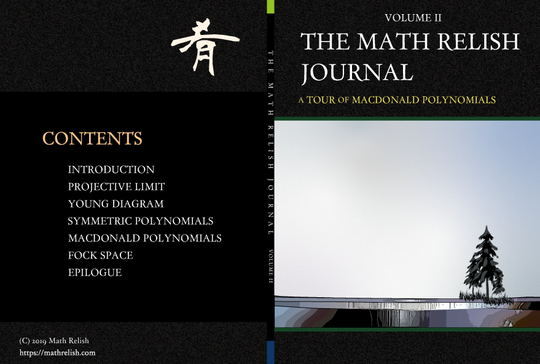
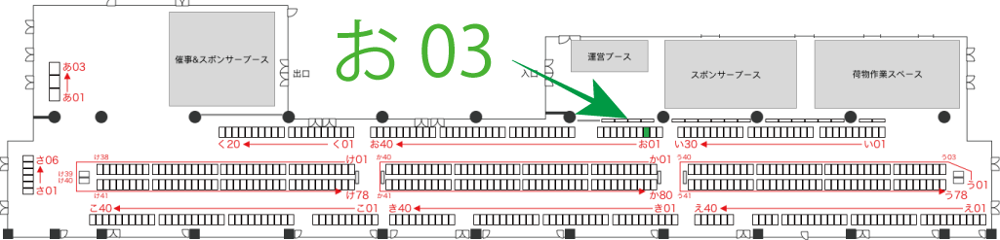
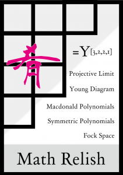
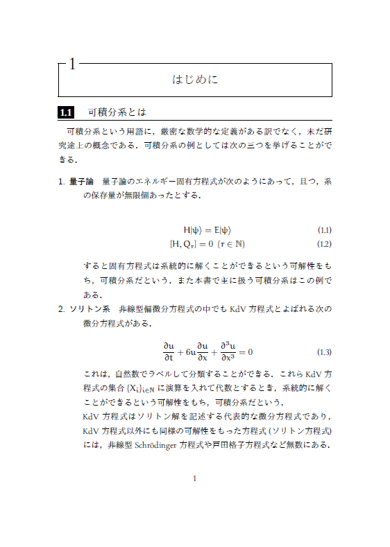
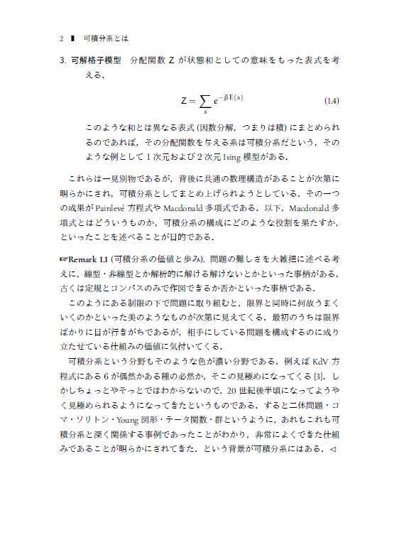

マクドナルド多項式！

[The Math Relish Journal Volume 2](https://mathrelish.booth.pm/items/1244077)

## 技術書典に初参加

Math Relish のジャーナル第二号を技術書典 6 「[お03 (サークル詳細)](https://techbookfest.org/event/tbf06/circle/67560004)」で頒布します．

### 動機

日々の活動の総合報告を定期的に物理的な形で発信していけたらいいな，というのが根底にあるのは変わりなく，この度，幸運にも技術書典に参加させていただくことになりました．

> 数学、化学、法学など各種専門分野、通信、アルゴリズムなど各種工学分野も技術書の範疇と考えています。 https://techbookfest.org/event/tbf06#faq

これを見て即決というところです．

「[お03 (サークル詳細)](https://techbookfest.org/event/tbf06/circle/67560004)」にてお待ちしております！！

## A Tour of Macdonald Polynomials

[The Math Relish Journal Volume 2](https://mathrelish.booth.pm/items/1244077)

今回は第二号ということでやや専門的な内容である可積分系について，Macdonald 多項式の文脈でまとめたものを頒布することにしました．

### 仕様

ペーパーバック，A5，48 ページ

### 内容紹介

#### 概要

本書は Ian Grant MacDonald によって 1987 年に導入された Macdonald 多項式を軸に，Fock 空間と (量子) 可積分系を述べた構成になっています．

すべての主張について証明を必ずしも与えておりませんが， 一つずつ順を追えば，誰しもある一定の理解を自分なりに持てることを目指して， 道筋の要点をまとめたものになっています． 特に射影極限をなるべく平易に述べたものは類書がないように思います．

* * *

2019 年，数学の Nobel 賞と言われる Abel 賞は Karen Keskulla Uhlenbeck に授与されることになりました．

- [The Abel Prize Laureate 2019](http://www.abelprize.no/c73996/binfil/download.php?tid=74122)
- [キャレン・アーレンベック 略歴](http://www.abelprize.no/binfil/download.php?tid=74106)

彼女の研究領域の一つが無限次元の可積分系です． これは弦理論の対称性を記述する Virasoro 代数と深い関係のある分野でもあります． (Uhlenbeck コンパクトと聞いてピンと来たかも？！)

本書ではこのような関係まで取り扱っておりませんが，より高度な理論へと進む前に， まずは Macdonald 多項式について味わってみてはいかがでしょうか．

#### 目次

1. はじめに
2. 逆系と射影極限
3. Young 図形と対称多項式
4. 無限変数への拡張
5. Macdonald 多項式
6. Fock 空間
7. エピローグ

### なか見！

[The Math Relish Journal Volume 2](https://mathrelish.booth.pm/items/1244077)
