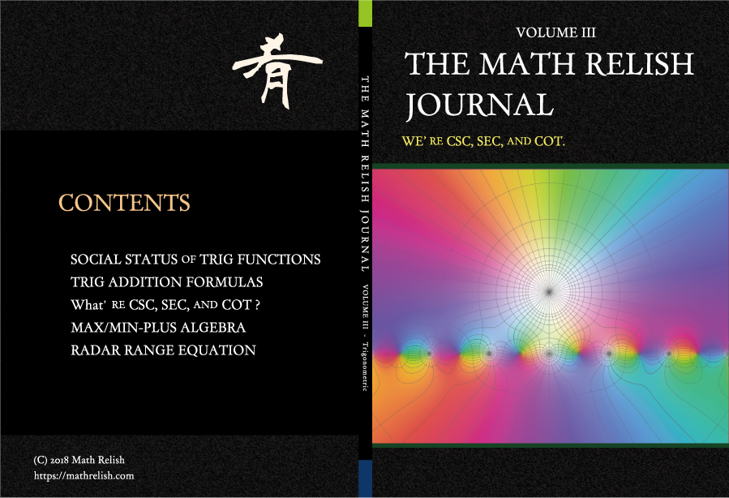
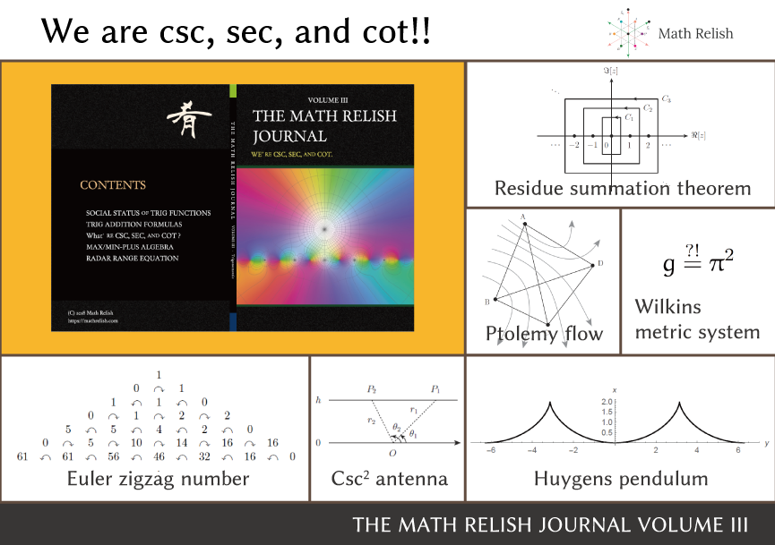
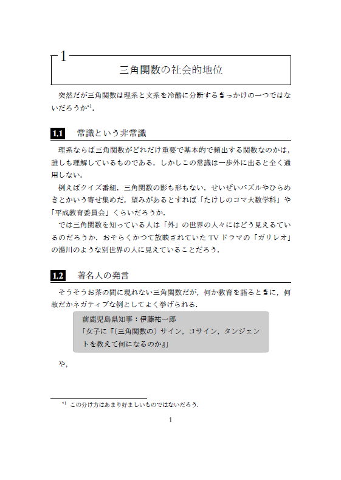
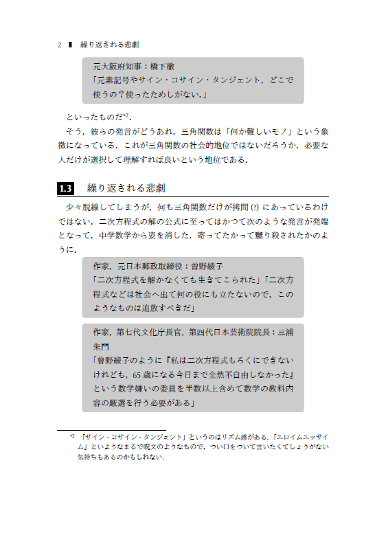

割三角関数の宴．

[The Math Relish Journal Volume 3](https://mathrelish.booth.pm/items/1473837)

## 令和初コミケ C96

コミケには２回目の出展です．年号の変わり目でもあり，有料化の回でした． 既刊も少部数でしたが再販し，ほぼ完売を達成できました！

気持ち，前回の C95 と比べて人の流れが少なかったような気がしました． とはいえ前回よりも頒布できた気がしますし，他ブース様と交流が持てた気もします． 継続は力なりというところでしょうか．

## We're csc, sec, and cot.

[The Math Relish Journal Volume 3](https://mathrelish.booth.pm/items/1473837)

### 仕様

ペーパーバック，A5，84 ページ

### 内容紹介

#### 概要

本書は三角関数の余り顧みられないであろう特徴について述べる ことで，それら関数の社会的地位の向上を目指すものです． (本書の一部の内容は Web 上に公開しているものとなります)

上記の図柄にありますように，主に次のトピックを扱っています．

- コセカント二乗ビームレーダ
- 等時曲線とサイクロイド振り子
- 留数の総和定理
- Euler のジグザグ数

これらはいろいろな事柄と関連していて，普段日の目を見ない割三角関数の有機的な躍動を感じられるのではないかと思います．忘れ去られた Wilkins の計量単位系の試みの話題のように，魔術的で野蛮な時代にあった歴史の断片も鑑賞できることでしょう．

中には電磁気学でのレーダ方程式の専門知識が必要な箇所がありますが，付録として導出の概要を示し，背後にある物理や工学についても触れます．この他，Max-Plus 代数 (もしくはトロピカル代数) とよばれる代数構造が，テトリスや Legendre 変換が関連することについて関連話題として同じく付録で触れます．

三角関数といえば周期現象ばかりが語られますが，本書を通してそれ以外の性質や応用を見ることで，また一味違った姿が見えてくるかもしれません．

#### 本論

1. [三角関数の社会的地位](https://mathrelish.com/mathematics/magic-hexagon-coaster)
2. [三角関数の加法定理](https://mathrelish.com/mathematics/trigonometric-addition-formulas)
3. csc, sec, cot って？

#### 付録

1. Max-Plus 代数
2. レーダ方程式

### なか見！

[The Math Relish Journal Volume 3](https://mathrelish.booth.pm/items/1473837)
