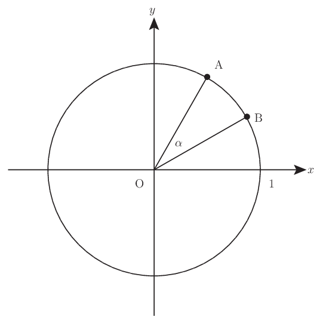
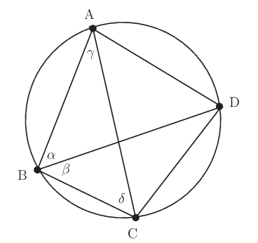
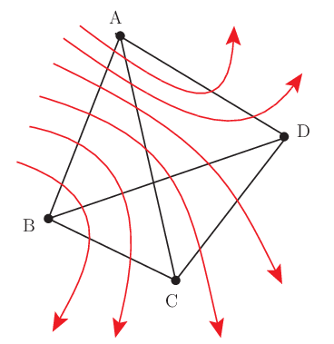

# 三角関数の加法定理

三角関数を巡る公式は山のようにある． このうちまずものにすべきは定義に関連する三角関数間の基本公式であり，次で触れている．

[三角関数の基本公式を完全攻略](https://mathrelish.com/mathematics/magic-hexagon-coaster/)

上記に慣れたら，次は三角関数の加法定理であろうか． 加法定理は次の定理を系として導く．

- 二倍角の公式
- 半角の公式
- 積和の公式
- 和積の公式
- 合成の公式

このためよく「加法定理が重要だ．他は導けるから，加法定理をしっかり押さえなさい．」とアドバイスされる．

ご尤も．

けれどももっと奥深いものがあるのではないだろうか．

## 着想と背景

三角関数の加法定理という公式には長い歴史がある． 科学史というのは学校教育では滅多に語られないが，ずっとずっと昔の人も三角関数の加法定理を使っていて，歴史ある，即ち大変に価値ある公式なのである． 色褪せることのないこの公式には色々な証明方法やそこから広がる世界がある． 中でも天動説で有名なプトレマイオスによる証明は幾何的で実にスッキリしている． オイラーの公式による証明は代数的な鮮やかさに圧倒される．

また循環論法という言葉をここではじめて聞くかもしれない． 加法定理の証明はラクしようとするとそういった落とし穴にハマる． このことについても後で少し触れたい．

## 主題

三角関数について次の恒等式が成り立つ． $$ \cos(\theta - \phi) = \cos\theta\cos\phi + \sin\theta\sin\phi $$

上記の定理が成り立つならば，以下の一連の加法定理が演繹される．

$$ \begin{eqnarray} \sin(\theta \pm \phi) &=& \sin\theta\cos\phi \pm \cos\theta\sin\phi \\ \cos(\theta \pm \phi) &=& \cos\theta\cos\phi \mp \sin\theta\sin\phi \\ \tan(\theta \pm \phi) &=& \frac{\tan\theta \pm \tan\phi}{1 \mp \tan\theta\tan\phi} \end{eqnarray} $$

上記の演繹は下記を用いて直ちに得られる．

$$ \begin{eqnarray} \sin\theta &=& \cos\left(\frac{\pi}{2} - \theta\right) \\ \sin(-\theta) &=& -\sin\theta \\ \tan\theta &=& \frac{\sin\theta}{\cos\theta} \end{eqnarray} $$

これら一群の恒等式を三角関数の加法定理とよんでいる．

## コメント

三角関数の加法定理を示すということは $\cos(\theta - \phi) = \cos\theta\cos\phi + \sin\theta\sin\phi$ さえ示すことができれば良いとわかった． このことも含めて，三角関数の加法定理についての様々な証明について以下にコメントする． また証明以外の関連するコメントも幾つか述べる．

### 余弦定理を用いた証明

これから示すように三角関数の加法定理は余弦定理に同値な命題である． そして余弦定理は三平方の定理や正弦定理に同値なので，[Magic Hexagon](https://mathrelish.com/mathematics/magic-hexagon-coaster/) がもつ情報量にこれら定理も含まれている． このような各定理の同値性があるため，「他は導けるから」という類いのアドバイスをされることが多いが，その導出が長い場合は触れられることなく，そもそも別の命題として認識してしまっていることがある． 殆ど多くの定理は同値であり，「他は導けるから」というアドバイスも突き詰めれば，何か数学の本質を理解したようなニュアンスを持っているが，単なるテクニックに過ぎないことが多い．

さて証明は次のとおり．

単位円上の二点 $\textrm{A},\textrm{B}$ の直交座標をそれぞれ $(x_{\textrm{A}},y_{\textrm{A}}), (x_{\textrm{B}},y_{\textrm{B}})$ とし，これら二点と原点とでできる三角形の角 $\alpha:=\textrm{AOB}$ について，余弦定理を適用する．

$$ \textrm{AB}^2 = \textrm{OA}^2 + \textrm{OB}^2 - 2\textrm{OA}\cdot\textrm{OB}\cos\alpha $$

二点 $\textrm{A},\textrm{B}$ が単位円上の点であることより，$\textrm{OA} = \textrm{OB} = 1$ であるから，これを用いて整理すると次のようになる．

$$ \cos \alpha = \frac{2 - \textrm{AB}^2}{2} $$

ここで $\textrm{AB}^2$ は三平方の定理より次のように求められる． 但し二点 $\textrm{A},\textrm{B}$ が単位円上の点であることより，$x_{\textrm{A}}^2 + y_{\textrm{A}}^2 = x_{\textrm{B}}^2 + y_{\textrm{B}}^2 = 1$ であることを用いる．これもまた三平方の定理である．

$$ \textrm{AB}^2 = (x_{\textrm{A}} - x_{\textrm{B}})^2 + (y_{\textrm{A}} - y_{\textrm{B}})^2 = x_{\textrm{A}}^2 + y_{\textrm{A}}^2 + x_{\textrm{B}}^2 + y_{\textrm{B}}^2 - 2(x_{\textrm{A}}x_{\textrm{B}} + y_{\textrm{A}}y_{\textrm{B}}) = 2[1 - (x_{\textrm{A}}x_{\textrm{B}} + y_{\textrm{A}}y_{\textrm{B}})] $$

よって次を得る．

$$ \cos \alpha = x_{\textrm{A}}x_{\textrm{B}} + y_{\textrm{A}}y_{\textrm{B}} $$

ところで $x$ 軸と直線 $\textrm{OA},\textrm{OB}$ のなす角をそれぞれ $\theta,\phi$ とすると，$\alpha = \theta - \phi$ であり，二点 $\textrm{A},\textrm{B}$の直交座標を極座標で書き直せば次を得る．

$$ \cos(\theta - \phi) = \cos\theta\cos\phi + \sin\theta\sin\phi $$

ここで暗に $\theta\textgreater\phi$ を仮定したが，それら以外についても上記が成り立つ． 何故ならば $\theta<\phi$ の場合は左辺の余弦関数が偶関数であることから不変であり，且つ右辺は角度の大小関係に関係なく点の座標から定まるのでやはり不変であって成立する． そして $\theta = \phi$ の場合は左辺が $1$ となり，且つ右辺は二点が同一点の場合であるから特に $\sin^2\theta + \cos^2\theta = 1$ より両辺は一致する．

故に以上にして加法定理が導かれた．■

### トレミーの定理による証明

トレミーとはプトレマイオス Ptolemaios の英語読み Ptolemy であり，何故だかこのときばかりトレミーとよんでいる． プトレマイオスは自著である『[アルマゲスト](https://amzn.to/2Ak7MQQ)』の第一巻第九章で次の定理を示しており，このために下記の定理をトレミーの定理と今日言っている．

円周上の四点 $\textrm{A},\textrm{B},\textrm{C},\textrm{D}$ について下記の等式が成り立つ．

$$ \textrm{AC}\cdot\textrm{BD} = \textrm{AB}\cdot\textrm{CD} + \textrm{AD}\cdot\textrm{BC} $$

実はトレミーの定理は $\alpha + \beta + \gamma + \delta = \pi$ を満たす四つの角度に適用された三角関数の加法定理である． それ故にトレミーの定理は三角関数の加法定理に関する一つの美しい幾何的な描像を与えてくれる．

上記の意味でトレミーの定理が三角関数の加法定理に同値であることの証明は次のとおりである．

今，下図のように角度を割り当てる．

適当な一つの三角形の内角の和を評価することで次を直ちに得られる．

$$ \alpha + \beta + \gamma + \delta = \pi $$

これから $\delta$ を消去できるとわかる．

また円周角の定理および正弦定理から三角関数を用いて辺の長さを次のように表すことができる． 但し円周の半径を $r$ とした．

$$ (\textrm{AC},\textrm{BD};\textrm{AB},\textrm{CD},\textrm{AD},\textrm{BC}) = (2r\sin(\alpha + \beta),2r\sin(\beta + \gamma);2r\sin\delta,2r\sin\beta,2r\sin\alpha,2r\sin\gamma) $$

よってトレミーの定理は次のように三角関数を用いて書き直せる．これを特にトレミーの恒等式という． 但し $\delta = \pi - (\alpha + \beta + \gamma)$ を用いた．

$$ \sin(\alpha + \beta)\sin(\beta + \gamma) = \sin(\alpha + \beta + \gamma)\sin\beta + \sin\alpha\sin\gamma $$

故にこれから $\beta + \gamma =\frac{\pi}{2}$ のとき，トレミーの定理が三角関数の加法定理に帰着するとわかる．

次に加法定理に同値な積和の公式とよばれる次の恒等式からトレミーの定理を導く． 導出はトレミーの恒等式の左辺と右辺を変形して一致することで示す．

$$ \sin\theta\sin\phi = \frac{1}{2}[\cos(\theta - \phi) - \cos(\theta + \phi)] $$

上式で $(\theta,\phi) = (\alpha + \beta,\beta + \gamma)$ と置くと，トレミーの恒等式の左辺は次のようになる．

$$ \sin(\alpha + \beta)\sin(\beta + \gamma) = \frac{1}{2}[\cos(\alpha - \gamma) - \cos(\alpha + \gamma + 2\beta)] $$

ここで $\alpha + \beta + \gamma + \delta = \pi$ を仮定して，次を得る．

$$ \cos(\alpha + \gamma + 2\beta) = \cos(\pi + \beta - \delta) = - \cos(\beta - \delta) $$

よって次式を得る．

$$ \sin(\alpha + \beta)\sin(\beta + \gamma) = \frac{1}{2}[\cos(\alpha - \gamma) + \cos(\beta - \delta)] $$

一方でトレミーの恒等式の右辺は積和の公式を用いて次のように変形できる．

$$ \sin\delta \sin\beta + \sin\alpha \sin\gamma = \frac{1}{2}[\cos(\delta - \beta) - \cos(\delta + \beta) + \cos(\alpha - \gamma) - \cos(\alpha + \gamma)] $$

ここで $\cos(-\theta) = \cos\theta$ および $\cos(\pi - \theta) = -\cos\theta$ であること，そして $\alpha + \beta + \gamma + \delta = \pi$ を用いれば次のように整理できる．

$$ \sin\delta \sin\beta + \sin\alpha \sin\gamma = \frac{1}{2}[\cos(\alpha - \gamma) + \cos(\beta - \delta)] $$

故にトレミーの恒等式として両辺は一致する．

以上より $\alpha + \beta + \gamma + \delta = \pi$ の下で，トレミーの定理と三角関数の加法定理は同値である．■

### オイラーの公式による証明

オイラーの公式とは次式のことである．

$$ e^{i\theta} = \cos\theta + i\sin\theta $$

もしこれと指数法則を認めると次式を直ちに得られる．

$$ \cos(\theta + \phi) + i\sin(\theta + \phi) = \cos\theta\cos\phi - \sin\theta\sin\phi + i(\sin\theta\cos\phi + \cos\theta\sin\phi) $$

両辺の実部と虚部を比較することで加法定理が得られる．

ここでオイラーの公式と指数法則が加法定理によって示されていないことが証明の大前提となっている． 何故ならばそうでないと，循環論法となってしまうからである．

例えば $e^{i\theta}e^{i\phi}$ を展開して実部と虚部に整理すると，$\cos\theta\cos\phi - \sin\theta\sin\phi + i(\sin\theta\cos\phi + \cos\theta\sin\phi)$ が表れるが，ここで加法定理を使って $e^{i(\theta + \phi)}$ としてしまうと，示すべき前提を用いてしまったこととなり循環論法になってしまう．

そもそも複素数 $z$ の指数関数は次の冪級数で定義される．

$$ e^z := \sum_{n=0}^{\infty}\frac{z^n}{n!} $$

このため「$e^z$ は $e$ を $z$ 回掛けた数」という意味は特別な場合を除いて有してはいない．$e^z$ は 一つの記号に過ぎない． この冪級数の定義を持って指数法則は次のように示される．

$$ e^{z_1 + z_2} = \sum_{n=0}^{\infty}\frac{(z_1 + z_2)^n}{n!} = \sum_{n=0}^{\infty}\sum_{a+b=n}\frac{z_1^a z_2^b}{a!b!} $$

ここで二項展開を用いた．各 $n$ に対して $a+b=n$ を満たす可能なすべての $\textrm{a},\textrm{b}$ について和を取るのだから，$\sum_{n=0}^{\infty}\sum_{a+b=n} = \sum_{a=0}^{\infty}\sum_{b=0}^{\infty}$ と和をとれる．よって次を得る．

$$ e^{z_1 + z_2} = \sum_{a=0}^{\infty}\sum_{b=0}^{\infty}\frac{z_1^a z_2^b}{a!b!} = e^{z_1}e^{z_2} $$

これで加法定理を仮定せずに指数法則が示された．それは指数関数の定義を伴ったものだった． 後はオイラーの公式である．

今，指数関数を冪級数で定義したが，それは複素変数についての拡張が必要だったからである． オイラーの公式の右辺に表れる三角関数は実変数についての関数であるため，改めて冪級数で定義することが蛇足に見える．実関数としてテイラー展開すればよいからである．

しかしテイラー展開の証明自体に加法定理に同値な主張を用いることになる． テイラー展開によって冪級数を得るためには次の三角関数の微分ができないといけない．

$$ \frac{d}{d\theta}\sin \theta = \cos\theta $$

これを示すために加法定理が必要になるからである． よってこれもまた循環論法となっている．

そこで「三角関数」を冪級数で次のように定義することを考える．

$$ \begin{eqnarray} \mathrm{SIN}z &:=& \sum_{n=0}^{\infty}\frac{(-)^n}{(2n+1)!} z^{2n+1} \\ \mathrm{COS}z &:=& \sum_{n=0}^{\infty}\frac{(-)^n}{(2n)!} z^{2n} \end{eqnarray} $$

この定義は自動的にオイラーの公式を満たすようになっている． 定義であるため加法定理は何も使用しておらず，循環論法に陥っていない． 一方で定義としたので，(このあえて強調するように大文字で書いた) 複素変数での三角関数が，単位円上で素朴に定義される通常の三角関数と一致するかを示す必要がある．

既に実変数での冪級数がどうあるべきか知っており，それは上記の定義を実数に制限した関数のことである． よって (論証が雑だが) $\mathrm{SIN},\mathrm{COS}$ は $\sin,\cos$ と表記すべき複素変数への一般化と名乗れる．

## 例

### 諸公式

#### 二倍角の公式

$$ \begin{eqnarray} \sin(\theta \pm \phi) &=& \sin\theta\cos\phi \pm \cos\theta\sin\phi \\ \cos(\theta \pm \phi) &=& \cos\theta\cos\phi \mp \sin\theta\sin\phi \\ \tan(\theta \pm \phi) &=& \frac{\tan\theta \pm \tan\phi}{1 \mp \tan\theta\tan\phi} \end{eqnarray} $$

上記の加法定理について，$\phi = \pm\theta$ として式を整理すると，二倍角の公式が得られる．

$$ \begin{eqnarray} \sin(2\theta) &=& 2\sin\theta\cos\theta \\ \cos(2\theta) &=& \cos^2\theta - \sin^2\theta \\ \tan(2\theta) &=& \frac{2\tan\theta}{1 - \tan^2\theta} \end{eqnarray} $$

必要ならば $\sin^2\theta + \cos^2\theta = 1$ を用いて適宜整理した次も二倍角の公式といっている．

$$ \cos(2\theta) = 1 - 2\sin^2\theta = 2\cos^2\theta - 1 $$

#### 半角の公式

$$ \cos(2\theta) = 1 - 2\sin^2\theta = 2\cos^2\theta - 1 $$

上記の二倍角の公式について，$\theta=\frac{\alpha}{2}$ と置いて次のように直ちに整理した恒等式を半角の公式という．

$$ \begin{eqnarray} \sin^2\frac{\alpha}{2} &=& \frac{1 - \cos\alpha}{2} \\ \cos^2\frac{\alpha}{2} &=& \frac{1 + \cos\alpha}{2} \\ \tan^2\frac{\alpha}{2} &=& \frac{1 - \cos\alpha}{1 + \cos(\alpha)} \end{eqnarray} $$

#### 積和の公式

$$ \begin{eqnarray} \sin(\theta \pm \phi) &=& \sin\theta\cos\phi \pm \cos\theta\sin\phi \\ \cos(\theta \pm \phi) &=& \cos\theta\cos\phi \mp \sin\theta\sin\phi \end{eqnarray} $$

上記の加法定理について，$\sin(\theta + \phi) \pm \sin(\theta - \phi)$ および $\cos(\theta + \phi) \pm \cos(\theta - \phi)$ をとることで，和積の公式とよぶ次の恒等式が得られる．

$$ \begin{eqnarray} \sin\theta\cos\phi &=& +\frac{1}{2}[\sin(\theta + \phi) + \sin(\theta - \phi)] \\ \cos\theta\sin\phi &=& +\frac{1}{2}[\sin(\theta + \phi) - \sin(\theta - \phi)] \\ \cos\theta\cos\phi &=& +\frac{1}{2}[\cos(\theta + \phi) + \cos(\theta - \phi)] \\ \sin\theta\sin\phi &=& -\frac{1}{2}[\cos(\theta + \phi) - \cos(\theta - \phi)] \end{eqnarray} $$

#### 和積の公式

$$ \begin{eqnarray} \sin\theta\cos\phi &=& +\frac{1}{2}[\sin(\theta + \phi) + \sin(\theta - \phi)] \\ \cos\theta\sin\phi &=& +\frac{1}{2}[\sin(\theta + \phi) - \sin(\theta - \phi)] \\ \cos\theta\cos\phi &=& +\frac{1}{2}[\cos(\theta + \phi) + \cos(\theta - \phi)] \\ \sin\theta\sin\phi &=& -\frac{1}{2}[\cos(\theta + \phi) - \cos(\theta - \phi)] \end{eqnarray} $$

上記の積和の公式について，$\theta + \phi = \alpha,\theta - \phi = \beta$ と置いて次のように直ちに整理した恒等式を和積の公式という．

$$ \begin{eqnarray} \sin\alpha + \sin\beta &=& +2\sin\left(\frac{\alpha + \beta}{2}\right)\cos\left(\frac{\alpha - \beta}{2}\right) \\ \sin\alpha - \sin\beta &=& +2\cos\left(\frac{\alpha + \beta}{2}\right)\sin\left(\frac{\alpha - \beta}{2}\right) \\ \cos\alpha + \cos\beta &=& +2\cos\left(\frac{\alpha + \beta}{2}\right)\cos\left(\frac{\alpha - \beta}{2}\right) \\ \cos\alpha - \cos\beta &=& -2\sin\left(\frac{\alpha + \beta}{2}\right)\sin\left(\frac{\alpha - \beta}{2}\right) \end{eqnarray} $$

#### 合成の公式

$$ \begin{eqnarray} \sin(\theta \pm \phi) &=& \sin\theta\cos\phi \pm \cos\theta\sin\phi \\ \cos(\theta \pm \phi) &=& \cos\theta\cos\phi \mp \sin\theta\sin\phi \end{eqnarray} $$

上記の加法定理について，偏角 $\phi$ について直交座標で次のように書き直したとする．

$$ \cos\phi = \frac{a}{\sqrt{a^2 + b^2}},~ \sin\phi = \frac{b}{\sqrt{a^2 + b^2}} $$

するとこれを代入して整理すると三角関数の合成公式 (Harmonic Addition Theorem) が得られる．

$$ \begin{eqnarray} a\sin\theta \pm b\cos\theta &=& \sqrt{a^2 + b^2}\sin\left(\theta \pm \arctan\frac{b}{a}\right) \\ a\cos\theta \mp b\sin\theta &=& \sqrt{a^2 + b^2}\cos\left(\theta \pm \arctan\frac{b}{a}\right) \end{eqnarray} $$

### Max-Plus 代数

Max-Plus 代数とは次で定義される和 $\oplus$ と積 $\otimes$ による代数をいう．

$$ \begin{eqnarray} x\oplus y &:=& \max[x,y] \\ x\otimes y &:=& x + y \end{eqnarray} $$

三角関数の加法定理に同値なトレミーの定理について，次の意味で Max-Plus 代数を見出すことができる．

トレミーの定理とは次の幾何学的な等式のことを言った．

$$ \textrm{AC}\cdot\textrm{BD} = \textrm{AB}\cdot\textrm{CD} + \textrm{AD}\cdot\textrm{BC} $$

このとき和 $+$ と積 $\cdot$ を Max-Plus 代数の和 $\oplus$ と積 $\otimes$ に置き直し，且つ二点間の線分長 $\textrm{XY}$ に対して線分をとおるフローの数 $\mathrm{flow}(\textrm{XY})$ に置き直した次の式が成り立つ．

$$ \mathrm{flow}(\textrm{AC}) + \mathrm{flow}(\textrm{BD}) = \max[\mathrm{flow}(\textrm{AB}) + \mathrm{flow}(\textrm{CD}), \mathrm{flow}(\textrm{AD}) + \mathrm{flow}(\textrm{BC})] $$

例えば上図の場合だと次のようになる．

$$ 4 + 4 = \max[6+2,2+2] \Leftrightarrow 8 = 8 $$

このようなトレミーの定理の類似は至るところにある． 例えばトレミーの定理はユークリッド幾何学の下での結果であったが，これを双曲幾何学の下でも類似を見出すことができる．より進んだ下記のようなもの (量子クラスター代数) の基礎としても用いられている．

- [Quantum cluster algebras from geometry](http://www.maths.bath.ac.uk/~masadk/seminar/geom/slides/mazzocco.pdf)

加法定理が今日でも基礎として生き残っている理由は応用的側面もさることながら，幾何的・代数的・解析的に見ても様々なところで基礎付けとして表れているところにあるのであろう． その度に温故知新の感に浸ることができる．悠久の時の中でこれからも加法定理は生き残るだろう．

## 参考

- [3角関数 (モノグラフ 13)](https://amzn.to/2mSOics)
- [アルマゲスト](https://amzn.to/2Ak7MQQ)
- [Trigonometry (Gel'Fand School Outreach Program)](https://amzn.to/2OqrSMn)
- [Ptolemy and non-Archimedes](http://www.wra1th.plus.com/gcw/rants/math/Ptol.html) (リンク切れ)

[三角関数の基本公式を完全攻略](https://mathrelish.com/mathematics/magic-hexagon-coaster/)
