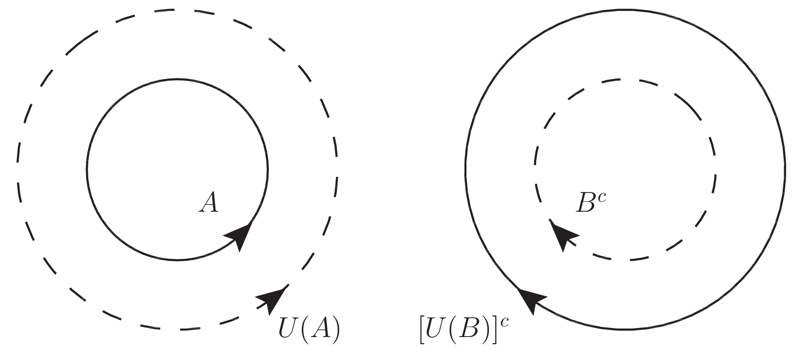
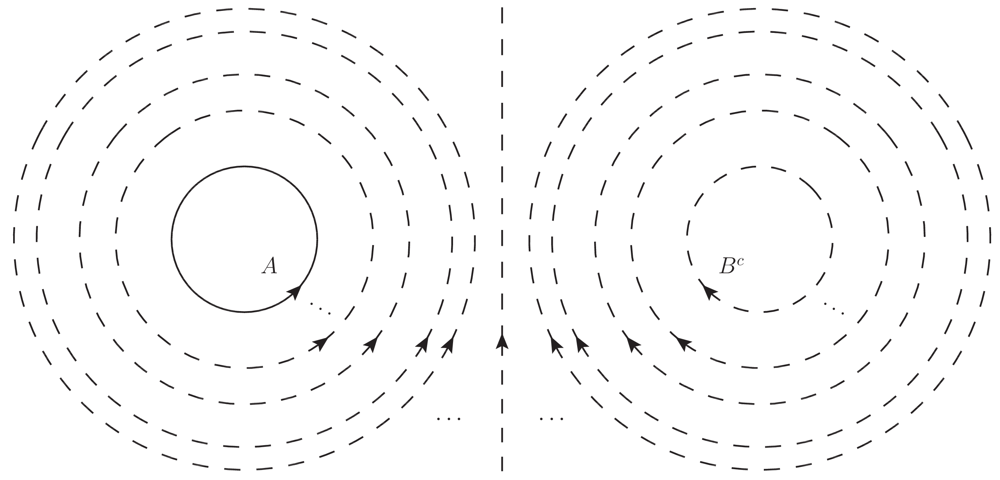

# ウリゾーンの補題

ウリゾーンの補題は正規空間とよばれる位相空間のクラスを特徴付ける一つの重要な定理である． また同時に選択公理という ZFC 公理系の C(hoice) の部分が証明で必要となる定理である． つまり ZF 公理系ではウリゾーンの補題は証明できない．

[The Math Relish Journal Volume 1S](https://mathrelish.booth.pm/items/1123647/)

## 着想と背景

ウリゾーンの補題は分離公理と密接に関連している． 必要となる空間を以下にザッとまず定義をしておく．



位相空間 $S$ の互いに素な任意の閉集合 $A,B$ について，$A,B$ それぞれの開近傍 $U(A),U(B)$ が $U(A)\cap U(B) = \emptyset$ を満たすならば，位相空間 $S$ はティーチェ空間もしくは $T_4$ 空間であるという．

　

位相空間 $S$ が $T_1$ 且つ $T_3$ であるならば，$S$ は正則空間であるという．

　

位相空間 $S$ が $T_1$ 且つ $T_4$ であるならば，$S$ は正規空間であるという．

分離公理は他にもたくさんあるが，上記含め，$T_0,T_1,T_2,T_3,T_4$ で大抵の基本的な事柄は語ることができる．

## 主題

正規空間 $S$ の任意の互いに素な二つの閉集合 $A,B$ に対して，ウリゾーン関数とよぶ次の連続関数 $f:S\rightarrow [0,1]$ が存在する．

$$ \begin{eqnarray} f(x) = 0 ~~ (\forall x\in A) \\ f(x) = 1 ~~ (\forall x\in B) \end{eqnarray} $$

証明は以下のとおり．

$S$ が正規であることから $T_4$ なので，次の包含関係が成立している．

$$ A \subset U(A) \subset [U(B)]^c \subset B^c $$

これは $T_4$ の定義付けで与えた分離公理の包含関係と同値である． 即ち閉集合 $A$，開集合 $B^c$ に対して上記の包含関係を満たす開集合 $U(A)$ と閉集合 $[U(B)]^c$ が存在する．

下図は包含関係 $A \subset U(A) \subset [U(B)]^c \subset B^c$ を意図して表したベン図である．

実線と破線はそれぞれ閉集合と開集合を表し，矢の進行方向に対して左側の領域が閉曲線で指定される領域を表している．補集合をとる操作は閉集合と開集合を入れ替えさせ，そして矢の進行方向を逆転させる．

ところでこの言及は再帰的になっている．つまり存在が保証された新たな開集合と閉集合を元にして再び $T_4$ 分離公理を (今の場合には $A \subset U(A)$ と $[U(B)]^c \subset B^c$ について $2$ 回) 適用できる． $T_4$ 分離公理を適用するというこの手続きを $k$ 回行ったとすると，$2^{k+1}$ 個だけある閉集合 ($2^k$ 個) と開集合 ($2^k$ 個) の増大列を得ることになる．特に開集合の増大列 $I$ だけとれば次のように整列させることができる．

$$ (A\subset) U_{\frac{1}{2^k}} \subset U_{\frac{2}{2^k}} \subset U_{\frac{3}{2^k}} \subset \cdots \subset U_{\frac{2^k-1}{2^k}}\subset U_1 = B^c $$

ここで $[0,1]$ を $2^k$ 等分する添字付けによって開集合の増大列を表した．この添字付けは任意の自然数 $k(=1,2,\cdots)$ について続けることができる (選択公理)．$S$ はこの開集合の増大列によって隈なく領域を階層的に分けられることになる．これはちょうど稠密な等高線の様相を呈している (下図参照)．

つまり $x\in S$ が属している開集合は一般に複数あるが，それらの部分的な増大列の中で下界となる $U_l$ が存在して，この $l$ を $x$ の高さと喩えて対応付けることができる．更に $x\in B$ を $1$ に対応付ければ，この写像 $f$ は示すべき写像が満たすべき条件のうち，連続関数であることを除いて満たしている．即ち次で $f$ を定義した．

$$ f(x) := \begin{cases} 1 & (x\in B) \ \inf \{ l ~|~ x\in U_l \} & (x\in A^c) \end{cases} $$

$f$ が連続関数であることは次のとおり． 今，上記に与えた $f$ の定義から次が成立している．

$$ \begin{eqnarray} x \in U_l &\Rightarrow& f(x) \leq l \ x \notin \bar{U}_l &\Rightarrow& x\in U_l \ f(x) < l &\Rightarrow& x\in U_l \ f(x) > l &\Rightarrow& x \notin \bar{U}_l \end{eqnarray} $$

以下，$\forall x_0\in S$ および $\epsilon\in\mathbb{R}_{>0}$ とする．

**$0< f(x_0)< 1$ の場合** このとき次不等式を満たす $l,l^{\prime}$ が存在する．

$$ f(x_0) - \epsilon < l < f(x_0) < l^{\prime} < f(x_0) + \epsilon $$

このとき $x \in U_l \Rightarrow f(x) \leq l$ と $x \notin \bar{U}_l \Rightarrow x\in U_l$ であることより次が従う．

$$ \begin{eqnarray} f(x_0) < l^{\prime} &\Rightarrow& x_0\in U_{l^{\prime}} \ f(x_0) > l &\Rightarrow& x_0 \notin \bar{U}_l \end{eqnarray} $$

また一方で $U_{l^{\prime}}\setminus \bar{U}_l$ は $x_0$ を含む $S$ の開集合になっている． これらから $U(x_0):=U_{l^{\prime}}\setminus \bar{U}_l$ は $x_0$ の開近傍とわかる．

さてこのことを踏まえて，$x \in U_l \Rightarrow f(x) \leq l$ と $x \notin \bar{U}_l \Rightarrow x\in U_l$ を用いれば，$\forall x\in U(x_0)$ に対して次が成立する．

$$ l\leq f(x)\leq l^{\prime} $$

よって $f(x_0) - \epsilon < l < f(x_0) < l^{\prime} < f(x_0) + \epsilon$ と合わせることで次を得る．

$$ |f(x) - f(x_0)| < \epsilon $$

**$f(x_0)=1$の場合** このとき $f(x_0)-\epsilon < l < f(x_0)$，即ち $1-\epsilon < l < 1$ を満たす $l$ が存在する． そして $x_0\notin \bar{U}_l$ であるから，$x_0\in \bar{U}_l^c$ である．これから $U(x_0):=\bar{U}_l^c$ と定めると，$U(x_0)$ は $x_0$ は開近傍になっている．よって再び同様の議論を行って，次を得る．

$$ |f(x) - 1| < \epsilon $$

**$f(x_0)=0$の場合** このとき $f(x_0)< l^{\prime} < f(x_0) + \epsilon$，即ち $0 < l^{\prime} < \epsilon$ を満たす $l^{\prime}$ が存在する． そして $x_0\in U_{l^{\prime}}$ であるから，$U(x_0):=U_{l^{\prime}}$ と定めると，$U(x_0)$ は $x_0$ は開近傍になっている．よって再び同様の議論を行って，次を得る．

$$ |f(x) - 0| < \epsilon $$

以上よりすべての場合について連続であることがいえた．故に上記に与えたウリゾーン関数 $f:S\rightarrow [0,1]$ は連続関数である．■

## コメント

### ウリゾーン関数と分離公理

ウリゾーンの補題はウリゾーン関数を通して位相空間上に実数 $\mathbb{R}$ を構成した点で著しい． ウリゾーン関数を定義するための開集合の増大列のとりかたは任意なので，様々な連続関数を構成できて，例えば $\mathbb{R}$ の直積への写像も容易に定義できる． このように位相空間がどれほど抽象的であっても，$T_4$ であるならば，実数 $\mathbb{R}$ を有しているのである．

更にウリゾーン関数が存在する位相空間について次が成立する．

ウリゾーン関数が存在する位相空間 $S$ は $T_4$ 分離公理を満たす．

$f|_A(x)=0$ および $f|_B(x)=1$ なるウリゾーン関数 $f:S\rightarrow [0,1]$ を用いて，次の二つの集合 $U_1,U_2$ を定義する．

$$ \begin{eqnarray} U_1 &:=& \left\{ x\in S ~\left|~ f(x) < \frac{1}{3} \right.\right\} \ U_2 &:=& \left\{ x\in S ~\left|~ f(x) > \frac{2}{3} \right.\right\} \end{eqnarray} $$

このとき明らかに次が成立する．

$$ U_1 \cap U_2 = \emptyset ~,~ A \subset U_1 ~,~ B \subset U_2 $$

また $f$ が連続であることより $U_1,U_2$ は開集合である．故に閉集合 $A,B$ を $U_1,U_2$ によって分離することになる．これは $T_4$ 分離に他ならない．■

### 第 2 可算公理とウリゾーンの距離付け定理

ウリゾーンの補題によって連続関数の存在が示された今，位相空間と距離空間の関係を密に議論することができる． 距離空間は位相空間の一例であったが，一般にその逆は成り立たない．この非自明な逆命題に関する議論には，次に述べる距離付け問題とよばれる問題がある．

今，距離空間としては与えられていない位相空間 $(S,\mathfrak{O})$ が与えられたとする． このとき位相空間 $(S,\mathfrak{O})$ から出発して，何らか距離関数 $d$ を定義できれば，$d$ を用いた位相 $\mathfrak{O}_d$ を構成することができる． このとき一般には $\mathfrak{O}_d\neq \mathfrak{O}$ であるが，一致することがあるかどうかを問う問題を距離付け問題という．この問題を論じるとき，第 2 可算公理が重要になるが，この定義と共に距離付けに関わる定理を記す．

位相空間 $(S,\mathfrak{O})$ が第 2 可算公理を満たすとは，$S$ のどんな開集合も適当な可算個の開集合の和集合としてかける (i.e.位相 $\mathfrak{O}$ は高々可算個の開基をもつ) ことをいう．

$$ O = \bigcup_{i\in\mathcal{I}}O_i ~~ (|\mathcal{I}| < 2^{\aleph_0}) $$

　

正規空間 $S$ が第 2 可算公理を満たすならば，$S$ は距離付け可能である．

ウリゾーンの距離付け定理は距離付け可能性に関する十分条件を与えている． 更に踏み込んで必要十分条件を与えるものとして次の定理が知られている．

位相空間 $S$ が距離付け可能であるための必要十分条件は，$S$ が $\sigma$-局所有限基底を持つ正則空間であることである．

これら定理は位相空間を基礎として構成される微分可能多様体が，距離という構造を備えるための公理として採用される．

## 例

### 実数，そしてスカラー場

ウリゾーンの補題はウリゾーン関数という連続関数の存在を述べた定理である． どのような位相空間を考えれば，連続関数が存在するのか．その一つの答えを述べている． 一方でウリゾーン関数と分離公理の関係から，ウリゾーン関数が存在すれば $T_4$ なる分離公理がその位相空間では成り立っている．

ウリゾーン関数は離れた位置にある閉集合で異なる値をとり，それらを連続に結びつけている． これは位相空間という抽象的な世界に実数というかなり豊かな構造が構築されているとみれる．

例えば単に連続関数ということを考えると値の変化しない一定値を与える関数 (定数関数) も連続関数である． これはとても自明な構造で「豊かさ」の対極にある「つまらない」例である． 何が「つまらない」かというと特別に調べることがないという文字通りのつまらなさである．

ウリゾーンの補題に紐づく帰結はそのような「つまらない」例ではない「豊かな」例を導いてくれる． 例えば密着位相をもった位相空間にはウリゾーン関数が存在しない．定数関数だけである． 一方でウリゾーンの補題はすごい．ウリゾーン関数は互いに素な閉集合の組ごとにたくさんあるのだ． 位相空間というもの，しいて言えば各点の特色を複数のウリゾーン関数によって特徴付けられるのである．

ウリゾーン関数はある点での幾何的な高さ (等高線) や温度分布 (等温線)，もしくは電位もっと抽象的にはポテンシャル (等位線) であったり，そういった (まだ座標変換性の概念は与えていないが) スカラー場が何かしら存在することを述べている．

こういった実りある連続関数が定数関数以外にたくさん存在する位相空間とはどのような空間であるのかをウリゾーンの補題は教えてくれる．

## 参考

- [集合・位相入門](https://amzn.to/2sU95yL)
- [位相への30講 (数学30講シリーズ)](https://amzn.to/2xXqPiD)
- [現代数学への招待:多様体とは何か (ちくま学芸文庫)](https://amzn.to/2Mwus4Z)

