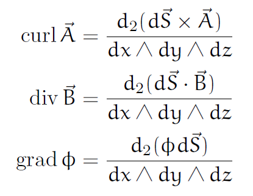

# 勾配・発散・回転の体積積分

勾配・発散・回転の体積積分が与えられることがある． これに関連した計算をDenker記法および外微分を用いて代数的に議論することができる．

なお以下は [濫用表記のすゝめ (微分記号)](https://mathrelish.booth.pm/items/5738559) の補足ノートからの引用である．

## 回転の体積積分

$\vec{A}=(A_x,A_y,A_z)$ の回転 $\mathrm{rot}\vec{A}$ はDenker記法を用いて次のように整理できる．

$$ \mathrm{rot}\vec{A} = \frac{1}{dx\wedge dy\wedge dz} \begin{bmatrix} dS_y\wedge dA_z - dS_z\wedge dA_y \\ dS_z\wedge dA_x - dS_x\wedge dA_z \\ dS_x\wedge dA_y - dS_y\wedge dA_x \end{bmatrix} $$

ここで次を定義した．

$$ d\vec{S} = \begin{bmatrix} dS_x \\ dS_y \\ dS_z \end{bmatrix} := \begin{bmatrix} dy\wedge dz \\ dz\wedge dx \\ dx\wedge dy \end{bmatrix} $$

さてこの $d\vec{S}$ は $2$ 形式であるから，$2$ 形式への外微分 $d_2$ を用いて次のような整理ができる．

$$ d_2(A_zdS_y) = dA_z\wedge dS_y = (-)^2dS_y\wedge dA_z = dS_y\wedge dA_z $$

よって次のように $\mathrm{rot}\vec{A}$ を整理できる．

$$ \mathrm{rot}\vec{A} = \frac{1}{dx\wedge dy\wedge dz} \begin{bmatrix} d_2(A_zdS_y - A_ydS_z) \\ d_2(A_xdS_z - A_zdS_x) \\ d_2(A_ydS_x - A_xdS_y) \end{bmatrix} $$

ここで $d_2$ を各成分にかかるものとしても表記し，クロス積を用いれば，次のようにも整理できる．

$$ \mathrm{rot}\vec{A} = \frac{d_2(d\vec{S}\times\vec{A})}{dx\wedge dy\wedge dz} $$

これより体積積分および発散定理を用いることで，次の等式を直ちに得ることもできる．

$$ \int_V \mathrm{rot}\vec{A} (dx\wedge dy\wedge dz) = \int_V d_2(d\vec{S}\times\vec{A}) = \oint_{\partial V} d\vec{S}\times\vec{A} $$

## 発散の体積積分

同様に発散 $\mathrm{div}\vec{B}$ はDenker記法の下で次のように表記できる．

$$ \mathrm{div}\vec{B} = \frac{d_2(d\vec{S}\cdot \vec{B})}{dx\wedge dy\wedge dz} $$

これから発散定理を用いて，次の等式を直ちに得ることもできる．

$$ \int_V \mathrm{div}\vec{B}(dx\wedge dy\wedge dz) = \int_V d_2(d\vec{S}\cdot \vec{B}) = \oint_{\partial V}d\vec{S}\cdot \vec{B} $$

## 勾配の体積積分

最後に勾配 $\mathrm{grad}\phi$ はDenker記法の下で次のように表記できる．

$$ \mathrm{grad}\phi = \frac{d_2(\phi d\vec{S})}{dx\wedge dy\wedge dz} $$

よって次の等式が直ちに得られる．

$$ \int_V \mathrm{grad}\phi(dx\wedge dy\wedge dz) = \int_V d_2(\phi d\vec{S}) = \oint_{\partial V}\phi d\vec{S} $$

## 関連

[Grassmann 代数と一階偏導関数 (Denker 記法)](https://mathrelish.com/mathematics/grassmann-algebra-and-first-partial-derivative-with-denkers-notation)

## 参考

- [濫用表記のすゝめ (微分記号)](https://mathrelish.booth.pm/items/5738559)

[The Math Relish Journal Volume 6 (BOOTH)](https://mathrelish.booth.pm/items/5738559)
